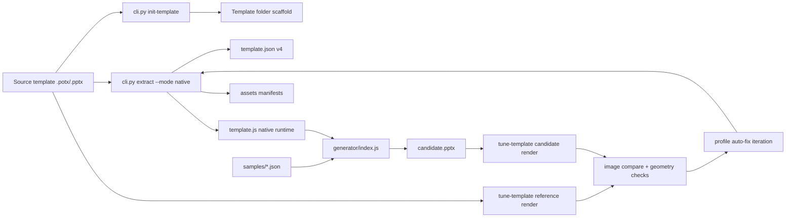

# kpmg-slidegen - Architecture

Last updated: 2026-02-05

This repository converts branded PowerPoint templates into repeatable JSON-to-PPTX generators.

## 1) Current System Shape

There are now two extraction/generation modes:

1. `legacy` mode:
- Preserves the existing Diligence behavior.
- Uses the established hardcoded builder mapping in generated `template.js`.
- Keeps Diligence output contract stable.

2. `native` mode:
- Exposes template-native layout types as `layout.<slug>`.
- Generates a generic layout renderer and per-layout slot contract.
- Designed for rapid onboarding of additional templates.

Diligence remains frozen unless explicitly approved.

## 2) Repository Map

```text
kpmg-slidegen/
  cli.py                              # init-template / extract / tune-template / validate / generate
  extractor/
    part_graph.py                     # multi-master + layout/media graph + dynamic slide dimensions
    codegen.py                        # legacy+native orchestration
    native_codegen.py                 # native template.json/template.js contract generation
    asset_pipeline.py                 # auto-manifest generation for assets/gradients
    template_scaffold.py              # template project scaffolding
    tuning.py                         # visual parity iterative loop
  templates/
    kpmg-diligence/                   # production legacy runtime (frozen)
    kpmg-talkbook/                    # first native onboarding target
    kpmg-valuations/                  # source artifacts
  tests/                              # extractor/runtime regression tests
  docs/
```

## 3) End-to-End Flow



## 4) CLI Contracts

## `init-template`

Purpose:
- Create a new template project shell.
- Copy source `.potx/.pptx`.
- Create `assets/`, `generator/`, `samples/`, `references/`, `outputs/`, `tools/`.
- Seed `template.profile.json` and `tuning.loop.json`.

## `extract`

New flags:
- `--mode {legacy|native}`
- `--all-layout-types`
- `--refresh-assets`
- `--profile <path>`

Behavior:
- Auto-generates asset manifests when missing.
- `legacy`: emits Diligence-compatible output contract.
- `native`: emits schema v4 with masters/layout-native slots.
- Native extraction keeps `samples/benchmark-normal.json` and `samples/benchmark-stress.json` in sync with the full extracted layout set (all variants).

## `tune-template`

Purpose:
- Run iterative reference-vs-candidate visual parity loop.
- Write per-round artifacts and metrics.
- Apply template-local profile fixes between rounds.
- Require final human approval gate when configured.

## 5) Extractor Internals

## 5.1 `part_graph.py`

Now captures:
- All slide masters (`masters` map).
- Layout-to-master mapping.
- Slide/layout/master media references.
- Dynamic slide dimensions from `ppt/presentation.xml` (`p:sldSz`).

Backward compatibility retained:
- `master_path` and `theme_path` still populated for legacy consumers.

## 5.2 `asset_pipeline.py`

Responsibilities:
- Build/refresh `assets/assets-base64.json`.
- Build/refresh `assets/gradient_data_uris.json`.
- Export referenced media to `assets/_exported_media/`.
- Render gradient fills from layout XML into PNG + data URI manifest.

## 5.3 `native_codegen.py`

Responsibilities:
- Build schema v4 template contract:
  - `templateMode`
  - `slideDimensions` (dynamic)
  - `masters`
  - `layouts` (`layout.<slug>`)
- Infer per-layout visual style (`backgroundColor`, heading/body/title color tokens, gradient decorations) so dark/blue variants render correctly.
- Emit deterministic `typeAliases` for ergonomic variant addressing (for example comparison/process/quad-blue aliases) while preserving canonical keys.
- Keep compatibility fields:
  - `colors`, `fonts`, `detectedLayoutSlots`, `layoutGeometry`, `usedLayouts`, `assets`
- Merge `template.profile.json` overrides:
  - required slot overrides
  - aliases
  - display names
  - master mapping
  - token/style overrides

## 5.4 `codegen.py`

Now dispatches by mode:
- `legacy`: old Diligence generator wrapper contract.
- `native`: generic layout renderer contract.

## 6) Native Slide Spec

Deck shape:

```json
{
  "metadata": {"title": "optional"},
  "slides": [
    {
      "type": "layout.<slug>",
      "slots": {
        "text_title": "...",
        "chart_1": {"chartType": "bar", "series": [...]}
      },
      "notes": "optional"
    }
  ]
}
```

Slot kinds currently supported:
- `text`
- `image`
- `table`
- `chart`

## 7) Tuning Loop Architecture

`extractor/tuning.py` performs:

1. Reference render:
- source template -> PDF (`soffice`) -> PNG (`pdftoppm`)

2. Candidate render:
- sample deck -> generator -> candidate PPTX -> PDF -> PNG

3. Comparison:
- SSIM (`chrome_ssim`, `content_ssim`)
- drift estimate in inches (`mean_slot_drift_in`, `max_slot_drift_in`)
- strict geometry counts (`severe_overlaps`, `out_of_bounds`)

4. Auto-fix phase:
- Writes template-local profile updates (`template.profile.json`)
- Re-runs native extraction for next round

5. Stop conditions:
- Pass all thresholds OR hit max rounds
- Optional mandatory human approval

Run artifacts:
- `templates/<template>/outputs/tuning/<run_id>/...`
- per round: `reference_png`, `candidate_png`, `diff_png`, `metrics.json`, `applied_fixes.json`, `round_summary.md`

## 8) Guardrails and Backward Compatibility

Hard guardrail enforced by tests/process:
- No unapproved modifications under `templates/kpmg-diligence/**`.

Behavioral compatibility:
- `legacy` remains default extraction mode.
- Diligence contract remains legacy-oriented.
- Shared extractor changes are regression-tested against Diligence template fixtures.

## 9) Talkbook Onboarding Status

Implemented at:
- `templates/kpmg-talkbook/`

Includes:
- copied source POTX
- native `template.json` + `template.js`
- generated sample benchmarks
- template profile + tuning config
- strict runtime scaffold

## 10) Test Coverage

Key coverage areas:
- multi-master part graph + dynamic dimensions
- native codegen asset/bootstrap behavior
- deterministic native layout keys
- tuning threshold evaluation logic
- Diligence freeze worktree check

Run:

```bash
python3 -m unittest discover -s tests -p 'test_*.py'
```
