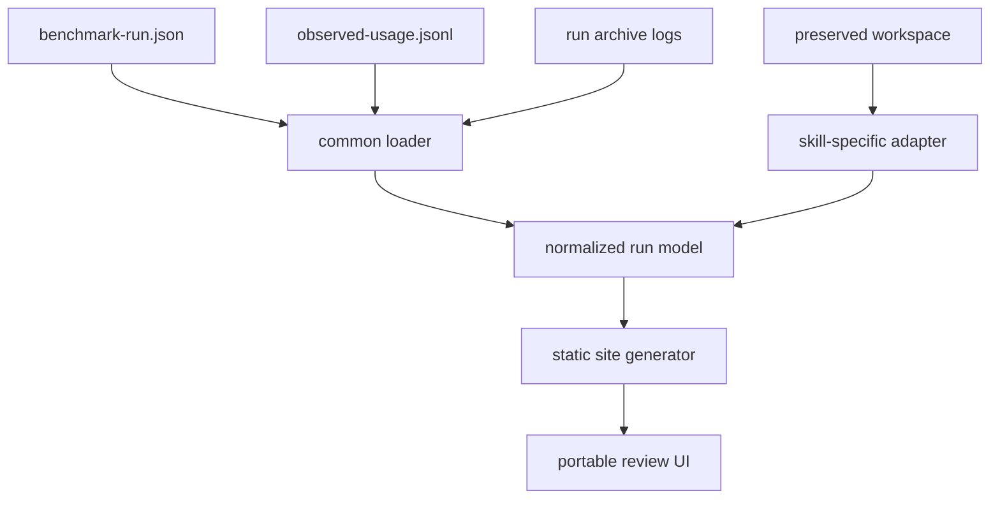
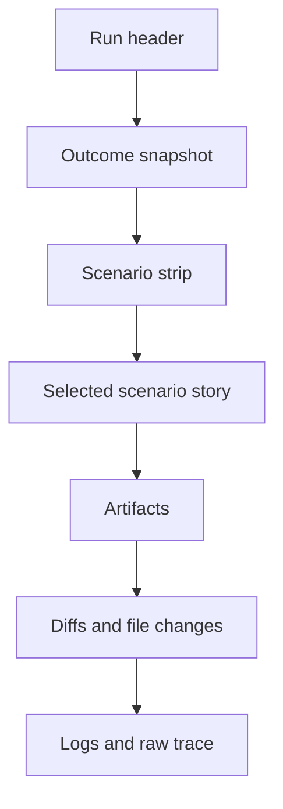

# Autoresearch Run Review Frontend

## Summary

Design one common portable frontend for reviewing autoresearch runs across both:

- `skills/autoresearch`
- `skills/skill-autoresearch`

The frontend should feel like a calm, linear run dossier rather than a dashboard-card mosaic.

It must:

- work as plain static HTML/CSS/JS
- avoid Vite, Next, React, or any bundler requirement
- be portable enough to open locally
- be generated from the actual run artifacts
- support both skills through one shared shell and two skill-specific data adapters

The key design problem is not visual chrome. It is data wiring.

The UI must make it intuitive to move from:

1. run list
2. scenario summary
3. prompt and verification contract
4. changed files and resulting artifact
5. raw logs and iteration evidence

without losing the thread of what the run was trying to prove.

## Design Goal

The user should be able to answer these questions quickly:

- Which runs passed, failed, or partially passed?
- What was the run trying to do?
- Which scenarios failed, and why?
- What prompt or task file drove the scenario?
- What did the run actually produce?
- What verifier or holdout rejected it?
- What changed on disk?
- For skill improvement runs: what changed in the target `SKILL.md`, and why was that rewrite kept?
- For task runs: what final artifact was produced, and was the fast path enough?

## Non-Goals

- No live multi-user app
- No server dependency
- No cloud backend
- No runtime dependence on ephemeral `/tmp` workspace paths
- No giant BI-style dashboard
- No attempt to make the frontend itself a general experiment platform

## Inspiration

The interaction model should borrow from:

- GitHub Actions run pages: run summary plus per-job logs and artifacts
- LangSmith trace compare and preview panes: side-by-side compare and preview-first drilldown
- Weights & Biases run comparer: diff-first comparison across runs

References:

- [GitHub Actions workflow run logs](https://docs.github.com/en/actions/how-tos/monitor-workflows/use-workflow-run-logs)
- [GitHub Actions artifacts](https://docs.github.com/en/actions/using-workflows/storing-workflow-data-as-artifacts)
- [LangSmith compare traces](https://docs.langchain.com/langsmith/compare-traces)
- [LangSmith configure run input and output preview](https://docs.langchain.com/langsmith/configure-input-output-preview)
- [W&B Run Comparer](https://docs.wandb.ai/models/app/features/panels/run-comparer)

## Source Data

The frontend must be generated from these real repo artifacts:

### Common benchmark sources

- `tests/plugin-eval/<skill>/latest/benchmark-run.json`
- `tests/plugin-eval/<skill>/latest/observed-usage.jsonl`
- `tests/plugin-eval/<skill>/runs/<run-id>/...`

These contain:

- run metadata
- scenario summaries
- prompts
- final message previews
- workspace change summaries
- telemetry
- verifier results
- raw Codex event logs

### Preserved workspace sources

Each benchmark scenario currently preserves a workspace path in the benchmark JSON.

Examples:

- general task run workspace
- skill improvement run workspace

These preserved workspaces contain the most useful review artifacts:

- `.autoresearch/session.md`
- `.autoresearch/verify.md`
- `.autoresearch/config.json`
- `.autoresearch/results.jsonl`
- `.autoresearch/evals/matrix.json`
- `.autoresearch/reports/baseline.md`
- `.autoresearch/reports/final.md`
- `.autoresearch/working/SKILL.*.md`
- final output artifacts such as `out/runbook.md`
- rewritten target files such as `fixtures/weak-summary-skill/SKILL.md`

## Critical Wiring Rule

Do not make the frontend depend on the preserved workspace staying alive in `/tmp`.

The generator must:

1. read the preserved workspace while it exists
2. copy the required review artifacts into the generated site
3. point the UI only at copied local site assets

This is mandatory.

The frontend should treat the original `workspacePath`, `runDirectory`, and other benchmark file paths as provenance, not as runtime dependencies.

## Common Data Model

Both skills should normalize into one view model.



### Site manifest

Each generated site should have a manifest like:

```json
{
  "generatedAt": "2026-04-19T23:26:09.482Z",
  "skills": ["autoresearch", "skill-autoresearch"],
  "runs": [
    {
      "runId": "2026-04-19T23-23-47",
      "skill": "autoresearch",
      "status": "completed",
      "scenarioCount": 3,
      "completedScenarios": 3,
      "failedScenarios": 0,
      "createdAt": "2026-04-19T23:26:09.482Z",
      "detailPage": "runs/autoresearch--2026-04-19T23-23-47/index.html"
    }
  ]
}
```

### Run record

Each run page should be driven by a normalized run object with:

- `runId`
- `skill`
- `createdAt`
- `status`
- `model`
- `summary`
- `usage`
- `scenarios[]`
- `artifacts[]`
- `adapterData`

### Scenario record

Each scenario should include:

- `id`
- `title`
- `purpose`
- `status`
- `durationMs`
- `prompt`
- `successChecklist[]`
- `finalMessagePreview`
- `usage`
- `verifierResults[]`
- `workspaceSummary`
- `workspaceChanges[]`
- `eventTimeline[]`
- `artifactRefs[]`

### Artifact record

Each artifact shown in the UI should have:

- stable display name
- local copied file path inside the generated site
- original source path
- type: `markdown | json | text | diff | log`
- role: `session | verify | config | matrix | baseline | final | results | output | rewritten-target | final-message | raw-log`

## Skill-Specific Adapters

The shared shell should not know skill-specific artifact semantics.

That belongs in two adapters.

### `autoresearch` adapter

This adapter should:

- infer whether the run was effectively `fast` or `deep`
- identify the primary output artifact from changed files outside `.autoresearch/`
- surface:
  - `session.md`
  - `verify.md`
  - `config.json`
  - final artifact such as `out/runbook.md`
- label the run outcome in task language:
  - task
  - output artifact
  - verifier
  - final result

Preferred derived fields:

- `mode`: `fast | deep`
- `outputArtifactPath`
- `verificationSummary`
- `guardSummary`

### `skill-autoresearch` adapter

This adapter should:

- resolve the target skill root inside the preserved workspace
- identify the rewritten live `SKILL.md`
- extract the `.autoresearch` contract artifacts
- parse `results.jsonl` into an iteration ledger
- parse `matrix.json` into a calibration vs holdout grid
- generate a diff between:
  - `working/SKILL.original.md`
  - `working/SKILL.best.md`
- surface:
  - `session.md`
  - `matrix.json`
  - `baseline.md`
  - `final.md`
  - `results.jsonl`
  - original vs best diff
  - final live `SKILL.md`

Preferred derived fields:

- `targetSkillPath`
- `iterationCount`
- `calibrationPassCount`
- `holdoutPassCount`
- `targetDiffSummary`

## Information Architecture

The frontend should be a static site with:

1. one combined index page
2. one detail page per run
3. optional compare mode on the index or detail page

### Page 1: Combined run index

Purpose:

- find the run you want
- understand run health at a glance
- compare runs before drilling in

Must include:

- skill filter: `All | autoresearch | skill-autoresearch`
- status filter: `Completed | Failed | Partial`
- sortable run list
- columns or cards for:
  - run id
  - skill
  - created time
  - completed vs failed scenarios
  - avg total tokens
  - duration summary
  - quick outcome text
- a compare-selection affordance for 2 runs

### Page 2: Run detail page

This should be the main experience.

The layout should feel like a linear dossier:



#### Run header

Show:

- skill name
- run id
- created time
- model
- overall status
- completed vs failed scenario count
- quick links:
  - open raw benchmark JSON
  - open observed usage

#### Outcome snapshot

Show:

- pass/fail bar
- average tokens
- generated file count
- verifier pass/fail counts
- one sentence of why this run matters

#### Scenario strip

A horizontal strip of scenario chips or compact cards:

- scenario name
- status
- duration
- tokens

Selecting a scenario should update the main story section.

#### Selected scenario story

This is the core chapter and should be linear:

1. Prompt
2. Success checklist
3. Final result
4. Verifier outcome
5. Changed files
6. Important artifacts

This is where the user should first understand what happened without reading logs.

#### Artifacts section

Show artifact previews in a stable order.

For `autoresearch`, default order:

1. output artifact
2. session
3. verification contract
4. config
5. final message

For `skill-autoresearch`, default order:

1. final live `SKILL.md`
2. original vs best diff
3. final report
4. baseline report
5. matrix
6. iteration ledger
7. session

#### Diffs and file changes

Show:

- grouped changed files
- line deltas
- which files are output vs eval scaffolding vs target edits

For `skill-autoresearch`, the `SKILL.md` diff must be first-class.

#### Logs and raw trace

Show a searchable log viewer for:

- Codex event stream
- Codex stderr
- verifier stdout
- verifier stderr

Do not make raw logs the default first thing a user sees.

They belong at the end.

## Compare Mode

Compare mode is worth doing because review is often comparative.

It should support 2 runs at a time.

Default compare fields:

- status
- completed vs failed scenarios
- avg tokens
- verifier pass count
- changed file count
- scenario-by-scenario status

For `skill-autoresearch`, also compare:

- calibration/holdout outcomes
- target `SKILL.md` diff summary

For `autoresearch`, also compare:

- output artifact preview
- mode guess: `fast` vs `deep`

This can be a secondary page or a drawer, not a full report builder.

## Visual Direction

The visual direction should feel like:

- calm lab notebook
- GitHub Actions run page discipline
- editorial spacing instead of dashboard clutter

Avoid:

- card mosaics
- too many nested tabs
- giant sidebars with tiny text
- heavy gradients
- generic admin-dashboard look

### Recommended shell

- off-white or warm paper background
- dark graphite text
- one cool accent for selection and active state
- green for pass
- amber for warn/partial
- red for fail

### Layout

Desktop:

- left rail or top strip for run/scenario navigation
- main narrative column
- optional right inspector for artifact previews

Mobile:

- stacked sections
- sticky section nav
- artifact drawer or accordions

## Interaction Rules

- Every important metric should be visible without expanding raw logs.
- Every preview should have an `Open raw` action.
- Every scenario should be linkable by anchor.
- Failed verifier output should be visible in one click.
- Diffs should default to meaningful text changes, not full raw files.
- Use copy buttons for prompts, final messages, and verifier output.

## Portability Contract

The frontend must work without a framework.

Recommended output shape:

```text
generated-site/
├── index.html
├── assets/
│   ├── styles.css
│   ├── app.js
│   └── ui.js
├── data/
│   ├── index.js
│   └── runs/
│       ├── autoresearch--2026-04-19T23-23-47.js
│       └── skill-autoresearch--2026-04-19T23-27-18.js
├── runs/
│   ├── autoresearch--2026-04-19T23-23-47/
│   │   └── index.html
│   └── skill-autoresearch--2026-04-19T23-27-18/
│       └── index.html
└── artifacts/
    └── ...
```

### Important implementation choice

Do not depend on `fetch()` from local `file://` pages.

Prefer:

- generated `data/*.js` files that assign to `window.__RUN_REVIEW_*__`
- or fully inlined page data

This keeps the site portable even when opened locally.

## Template Strategy

Most of the UI should live in one shared shell template.

Per-skill customization should be limited to:

- data adapter
- artifact ordering
- run summary copy
- one or two skill-specific panels

That means:

- common shell: shared
- common CSS: shared
- common JS renderer: shared
- adapter logic: per skill
- panel registry: per skill

## Generation Strategy

The implementation should generate the site from repo artifacts in 3 layers:

1. load and normalize benchmark metadata
2. snapshot and copy workspace artifacts
3. render static pages from shared templates

The generator should be allowed to be Python or Node, but it should not require a bundler.

## What The User Must See For Every Run

This is the minimum review surface:

- run id
- skill name
- created time
- scenario count
- prompt for each scenario
- final result summary
- verifier output
- changed files
- copied artifact previews
- raw logs
- tokens and duration

And the skill-specific extras:

### For `autoresearch`

- task scope
- verification contract
- final artifact preview
- whether fast mode was enough

### For `skill-autoresearch`

- target skill path
- baseline summary
- final summary
- matrix preview
- iteration ledger
- original vs best diff

## Acceptance Criteria

The spec is satisfied when:

1. One shared frontend shell can review runs from both skills.
2. Each skill has its own adapter, not its own separate full UI.
3. The generated site works without Vite, Next, or a JS framework.
4. The site can be opened locally without network dependencies.
5. The site does not depend on `/tmp` paths remaining alive.
6. The detail page makes it easy to move from prompt -> result -> verifier -> artifact -> logs.
7. `skill-autoresearch` exposes matrix, iteration, and target diff clearly.
8. `autoresearch` exposes task contract and output artifact clearly.

## Recommended First Version

Ship v1 with:

- combined index page
- run detail page
- copied artifact previews
- scenario strip
- file change list
- raw log viewer

Treat compare mode as a stretch goal if needed, but structure the data model so it can be added cleanly.
