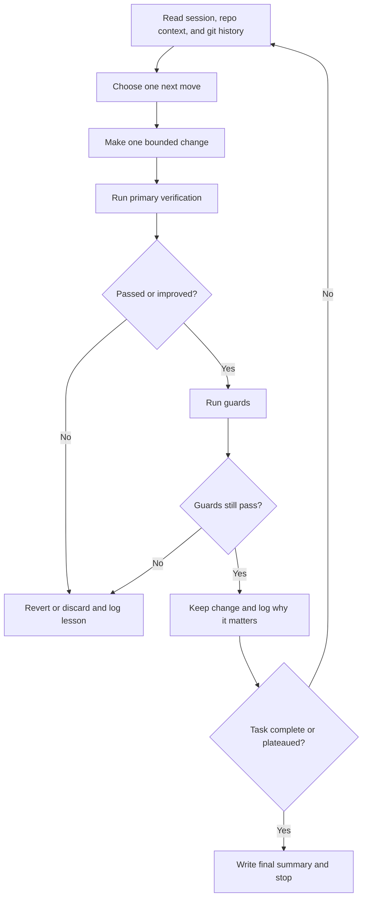

# Autoresearch General Task Spec

## Summary

This document specifies the broader companion skill, tentatively named `autoresearch`.

Its job is to apply the autoresearch loop to general work, not just skill improvement.

That means:

- take a concrete task
- turn it into a bounded objective with a verification contract
- iterate toward completion
- keep real progress
- stop with a completed artifact or an honest boundary

This is the general skill. It should stay smaller than the broadest public `autoresearch` repos.

## Upstream Lineage

This spec is grounded in the same three external repositories plus the local `auto-research-eval` replacement work.

The synthesis is:

- from `karpathy/autoresearch`: constrained scope, baseline-first, commit-then-verify, keep/discard, and explicit autonomy
- from `pi-autoresearch`: session documents, append-only logs, optional checks, and separation between engine and policy
- from `uditgoenka/autoresearch`: guard semantics, precondition checks, git-history review, plateau detection, and clear porting lessons for Codex

The deliberate rejection is just as important:

- do not ship ten loosely-related modes in v1
- do not claim “works on anything” without a real verify path
- do not force Codex users through Claude-style interactive command trees

## Canonical Name

Recommended canonical skill name: `autoresearch`

Why this should own the simpler name:

- it is the general companion to `skill-autoresearch`
- it is the main reusable loop surface
- it aligns with the external lineage while still allowing a narrower skill-specific variant

## Job To Be Done

When a user says things like:

- “run an autoresearch loop on this”
- “improve this task step by step without guessing”
- “keep iterating until the checks pass”
- “treat this like an optimization or completion loop”

the skill should:

1. shape the task into an objective
2. define scope and non-goals
3. define a verify contract
4. establish a baseline
5. iterate with one change at a time
6. stop when the task is done, blocked, or plateaued

## Non-Goals

- It is not a generic router for security, shipping, scenario design, debate, and documentation all at once.
- It is not a substitute for the `research`, `debug`, `review`, or `skill-audit` skills when those are more direct fits.
- It should not default to an infinite overnight loop unless the user explicitly asks for that mode.
- It should not invent numeric metrics for tasks that do not support honest verification.

## The Core Promise

`autoresearch` should work for any task that can be reduced to one of these verification shapes:

1. Scalar metric
Example: runtime, size, score, coverage, throughput.

2. Binary checks
Example: tests pass, build passes, file exists, output matches schema, required sections present.

3. Composite checklist
Example: 5 required deliverables complete, 2 regressions absent, 1 guard still passing.

4. Judge-backed binary rubric
Example: output satisfies a small, explicit set of qualitative requirements that code cannot fully decide.

If none of those are honestly available, the skill should either refuse the loop or switch into a bounded planning or research pass.

## Design Principles

1. Start by shaping the task.
The hardest part is often not the edit. It is choosing the right success contract.

2. Verification is the product.
If the verify path is weak, the loop is weak.

3. Default to bounded autonomy.
In Codex, most tasks should run until complete or until an explicit stop condition, not “forever.”

4. Use git as memory when git is present.
Read recent history every iteration. Keep useful wins inspectable.

5. Keep the public surface small.
One skill, one loop, a few clear options. Not ten mini-products.

6. Support sub-agents where they help.
Use them for research, decomposition, and independent review, not for the core keep/discard judgment on every pass.

## Session Contract

Use the same workspace shape as `skill-autoresearch`, but with task-oriented files:

```text
.autoresearch/
├── session.md
├── results.jsonl
├── config.json
├── verify.md
├── checks/
├── reports/
│   ├── baseline.md
│   ├── progress.md
│   └── final.md
└── ideas.md
```

Rules:

- `session.md` describes the task, scope, invariants, and current theory of progress.
- `verify.md` explains the exact keep/discard contract in human-readable terms.
- `results.jsonl` remains the append-only source of truth.
- `ideas.md` is optional and only for deferred promising paths.

## Workflow

### Phase 1: Task Shaping

- read the user request and local context
- identify the concrete artifact or outcome
- decide whether this is an autoresearch-fit task
- define what “done” means

### Phase 2: Scope And Verification

- define files or surfaces in scope
- define surfaces out of scope
- define one primary verification path
- define optional guards

Examples of good guards:

- existing tests must keep passing
- a reference file must not change
- output schema must remain valid
- performance win must not exceed a memory threshold

### Phase 3: Baseline

- run the unmodified task path once
- record the initial score or pass state
- document current blockers and likely leverage points

### Phase 4: Iteration Loop



Iteration rules:

- one hypothesis per loop
- one change cluster per loop
- commit before verify when git is in play
- do not silently rewrite the success contract
- stop when the task is complete, blocked, or clearly plateaued

## Verification Modes

### Mode A: Numeric

Use when the task has a scalar output.

Examples:

- `bundle_kb`
- `runtime_ms`
- `coverage_percent`
- `token_count`

### Mode B: Binary

Use when the task is really pass/fail.

Examples:

- build succeeds
- tests pass
- spec file generated
- JSON schema valid

### Mode C: Composite

Use when the task is completion-oriented rather than optimization-oriented.

Example composite score:

- 60 points if the required artifact exists
- 20 points if validation passes
- 20 points if guard checks still pass

### Mode D: Judge-Backed

Use sparingly.

Requirements:

- binary verdict only
- explicit pass/fail definitions
- at least one pass example and one fail example
- separate holdout evaluation when practical

## Task Classes That Fit Well

- code optimization with tests or benchmarks
- bug fixing with reproducible failures
- structured documentation generation with validation checks
- refactors with regression guards
- packaging or data transformation tasks with schema checks
- prompt or workflow optimization when a grounded eval matrix exists

## Task Classes That Fit Poorly

- pure brainstorming with no success contract
- subjective design taste work without a rubric
- open-ended strategy work with no artifact boundary
- tasks whose only evaluation is “does this feel better?”

For those, this skill should route the user toward `research`, `brainstorm`, `review`, or another narrower skill instead of pretending the loop is valid.

## Sub-Agent Model

Recommended sub-agent roles:

- `context scout`: reads the repo or task environment and maps constraints
- `verify designer`: proposes good primary metrics and guards
- `independent reviewer`: sanity-checks whether a claimed improvement is real
- `sidecar implementor`: handles disjoint non-blocking subtasks while the main loop continues

Rules:

- sub-agents are strongest during setup and checkpoint review
- the main loop retains the final keep/discard judgment
- if a sub-agent writes code, its write scope must be disjoint and explicit

## Triggering And User-Facing Contract

Recommended trigger language in `SKILL.md` frontmatter:

- use when the user wants an autoresearch loop for a concrete task with a real verification path
- use when the work benefits from baseline, iteration, guards, and keep-or-discard logging
- do not use when the task is better served by pure research, brainstorming, or one-shot implementation

This skill can be implicitly invoked when the request clearly matches the loop model, but its body should still ask the agent to confirm a verification path before iterating.

## Minimal Bundle Shape

```text
skills/autoresearch/
├── SKILL.md
├── agents/
│   └── openai.yaml
└── references/
    ├── core-loop.md
    ├── verify-design.md
    ├── guard-patterns.md
    ├── task-fit-rubric.md
    └── stop-rules.md
```

The bundle should stay smaller than the broad public repos:

- no giant domain catalog
- no shipping matrix
- no security command tree
- no scenario-generation framework
- no packaging instructions inside the skill body

## Explicit Anti-Patterns

- routing every vaguely hard task into autoresearch
- running a loop without a stable verify contract
- using “forever” as the default stop rule
- making several unrelated edits per iteration
- keeping changes because they feel promising without passing guards
- turning the skill into a bag of subcommands with overlapping purposes
- letting install or mirror docs drift away from the real Codex shape

## Future Extensions Not In V1

- a separate `autoresearch-finalize` skill for branch cleanup
- optional lightweight dashboard generation from `results.jsonl`
- optional `learn` companion for documentation-only loops
- optional `security` or `reason` companion skills if those prove worth their own narrow bundles

Those should be separate follow-on skills, not bundled into the first release.
