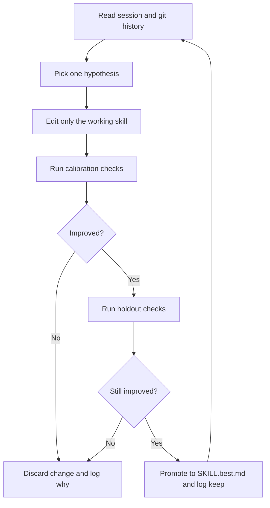

# Skill Autoresearch Spec

## Summary

This document specifies a new skill, tentatively named `skill-autoresearch`, that replaces the dated former `auto-research-eval` workflow.

Its job is narrow and important:

- improve an existing Codex skill through an autoresearch loop
- use explicit failure modes and holdout cases
- prefer mechanical checks over subjective judging
- keep a durable experiment ledger
- stop with a clear best candidate, not with vague advice

This is the skill-focused replacement. It is not the general-purpose task skill.

## Upstream Lineage

This spec is based on a full local read of:

- [karpathy/autoresearch](https://github.com/karpathy/autoresearch)
- [davebcn87/pi-autoresearch](https://github.com/davebcn87/pi-autoresearch)
- [uditgoenka/autoresearch](https://github.com/uditgoenka/autoresearch)

The synthesis is:

- `karpathy/autoresearch` contributes the irreducible core: constrained scope, baseline-first measurement, one experiment at a time, keep-or-discard, and git as memory.
- `pi-autoresearch` contributes the most useful product ideas: first-class session files, append-only logs, optional checks, and a clean separation between engine behavior and skill policy.
- `uditgoenka/autoresearch` contributes good protocol details: precondition checks, guarded verification, explicit plateau handling, and Codex-port lessons.
- the existing `auto-research-eval` skill contributes the right eval shape for skills: binary failure modes, code-first checks, holdout inputs, and judge prompts only when code cannot decide.

## Why This Replaces `auto-research-eval`

The current skill has the right ambition but the wrong center of gravity.

What it gets right:

- a `setup -> configure -> run -> review` lifecycle
- skill-local eval scenarios and judge prompts
- binary pass/fail emphasis
- generated project-local state instead of mutating the skill package itself

What needs to change:

- it is too scaffold-first and not explicit enough about git memory, holdouts, and overfitting control
- its state contract is older and more file-heavy than necessary
- it does not benefit from the cleaner session-document and append-only-log patterns that the later repos discovered
- it does not clearly separate calibration artifacts from iteration artifacts

## Canonical Name

Recommended canonical skill name: `skill-autoresearch`

Rejected alternatives:

- `auto-research-eval`: too tied to the older implementation
- `skill-eval-loop`: accurate but misses the autoresearch lineage
- `autoresearch-skill`: workable, but less natural alongside a future general `autoresearch` skill

Deprecation rule:

- `auto-research-eval` becomes a deprecated shim or is hard-cut removed after the new skill lands

## Job To Be Done

When a user says things like:

- “improve this skill”
- “run an eval loop on this skill”
- “make this skill better without guessing”
- “optimize this skill against real failure modes”

the skill should:

1. inspect the target skill and its adjacent references
2. define or refine an evaluation contract
3. establish a baseline
4. iterate one focused change at a time
5. keep only real improvements
6. finish with a best candidate and a reviewable record

## Non-Goals

- It is not a generic “improve anything” skill.
- It is not a packaging or publishing skill.
- It is not a dashboard product in v1.
- It is not a benchmark engine for arbitrary shell commands.
- It should not absorb `skill-audit`, `plugin-eval`, or general repo planning into one mega-skill.

## Design Principles

1. One target surface.
The editable target is one skill root. The skill may read references, tests, and adjacent docs, but the optimization target stays explicit.

2. Code-first verification.
Use code checks before LLM judges. Judges are the exception path, not the default.

3. Holdouts are mandatory.
Do not let the loop optimize only against the cases that were used to invent the rubric.

4. Git is memory.
Each kept change must remain inspectable. Each rejected change must still leave a breadcrumb in the run ledger.

5. One change per iteration.
If an iteration wins, we should know why.

6. Generated state lives outside the skill package.
The skill bundle stays lean. Session files live in the target project.

7. Resume must be cheap.
A fresh agent should be able to continue from the session files without re-deriving everything.

## Session Contract

The target project gets one canonical hidden workspace:

```text
.autoresearch/
├── session.md
├── results.jsonl
├── config.json
├── holdout.md
├── working/
│   ├── SKILL.original.md
│   ├── SKILL.current.md
│   └── SKILL.best.md
├── evals/
│   ├── matrix.json
│   ├── scenarios/
│   └── judges/
├── reports/
│   ├── baseline.md
│   ├── latest.md
│   └── final.md
└── ideas.md
```

Rules:

- `session.md` is the human-readable memory anchor.
- `results.jsonl` is the append-only source of truth.
- `working/` contains copies of the target `SKILL.md` state, not the whole skill package.
- `evals/` contains calibration and holdout material.
- `reports/` contains derived summaries, not canonical state.

## Evaluation Model

The scoring model is a matrix:

- rows: scenarios or user prompts
- columns: failure-mode checks
- cells: `Pass | Fail | N/A`

There are three check types:

1. Deterministic code checks
Examples: contains required phrase, valid YAML frontmatter, no broken relative links, expected section exists, output matches schema.

2. Structured judge checks
Use only when code cannot decide. Must be binary and example-backed.

3. Repo-specific extension checks
Optional hooks such as `plugin-eval`, token budget reports, or rubric checks may run as secondary signals, but the primary keep/discard decision stays tied to the matrix.

Holdout policy:

- one calibration set used to shape the loop
- one holdout set used only for baseline and checkpoint validation
- holdouts are never rewritten mid-loop except by explicit human instruction

## Workflow

### Phase 1: Intake and Scope

- resolve the target skill root
- inventory `SKILL.md`, references, scripts, and tests
- identify what success means for this skill
- identify what must not change

### Phase 2: Eval Design

- define 3-7 failure modes
- write code checks first
- add judge checks only for genuinely subjective gaps
- create a small calibration scenario set
- create a separate holdout scenario set

### Phase 3: Baseline

- copy the target `SKILL.md` into `working/`
- run the full matrix against the unchanged skill
- record baseline scores in `results.jsonl`
- summarize strongest and weakest dimensions in `reports/baseline.md`

### Phase 4: Iteration Loop



Iteration rules:

- one hypothesis per pass
- one focused edit per pass
- calibration before holdout
- holdout before keep
- log the rationale, not just the result

### Phase 5: Review and Finalize

- compare original vs best
- summarize what improved, what regressed, and what was preserved
- generate a final recommendation:
  - adopt
  - adopt with review
  - reject and keep original

## Sub-Agent Model

Sub-agents are optional but explicitly supported.

Recommended roles:

- `failure-mode scout`: finds likely ways the skill can fail
- `holdout writer`: proposes realistic prompts that are not tuned to the draft rubric
- `judge reviewer`: audits judge prompts for leakage and ambiguity
- `independent verifier`: checks whether a claimed win still looks real on holdouts

Rules:

- sub-agents help most in setup and checkpoint review
- the main iteration loop stays centralized
- sub-agents do not get the intended “right answer” when validating holdouts

## Triggering And User-Facing Contract

Recommended trigger language in `SKILL.md` frontmatter:

- use when improving an existing Codex skill through repeated evaluation and prompt revision
- use when a skill needs measurable failure-mode reduction rather than one-shot rewriting
- use when the user wants baseline, iteration, holdouts, and final comparison

This skill should be explicitly invoked, not implicitly ambient.

## Minimal Bundle Shape

```text
skills/skill-autoresearch/
├── SKILL.md
├── agents/
│   └── openai.yaml
├── references/
│   ├── judge-design.md
│   ├── session-contract.md
│   ├── eval-matrix-design.md
│   └── anti-overfitting.md
└── templates/
    └── autoresearch/
```

Bundle guidance:

- no README in the skill folder
- no runtime experiment outputs in the skill folder
- references should be short and directly loadable from `SKILL.md`

## Explicit Anti-Patterns

- optimizing only against the prompts that invented the rubric
- using one vague “overall quality” judge
- changing the eval contract every time the loop loses
- treating `plugin-eval` or `skill-audit` as the sole success metric
- keeping a win that only passes calibration and fails holdout
- making multi-concept edits and pretending the result is attributable
- bloating the skill bundle with dashboards, release helpers, or packaging docs

## Future Extensions Not In V1

- optional HTML dashboard generated from `results.jsonl`
- optional branch finalization helper like `pi-autoresearch-finalize`
- optional integration with `plugin-eval` metric packs

Those are deliberately out of scope for the first build.
