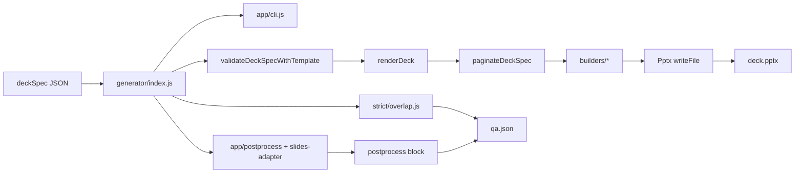

# KPMG Slide Generator

Runtime-focused generator that converts a typed `deckSpec` JSON into:
- a branded `.pptx`
- a consolidated QA `.json`
- optional visual postprocess artifacts (preview PNGs, montage PNG, visual overflow diagnostics)

## Naming

- **KPMG SlideGen** is the engine/repo (this codebase).
- **KPMG Slides** is the first distributable skill, located at `skills/kpmg-slides/`.

This file is the operational guide. Architecture source-of-truth is `ARCHITECTURE.md`.

## 1) Quick Start

## Default generation

```bash
npm run generate
```

Equivalent direct command:

```bash
node generator/index.js \
  --in decks/deckspec-starter-template.deckSpec.json \
  --out outputs/my-run/deck.pptx \
  --qa-out outputs/my-run/qa.json
```

## Strict generation

```bash
node generator/index.js \
  --in decks/deckspec-starter-template.deckSpec.json \
  --out outputs/my-run/deck.pptx \
  --qa-out outputs/my-run/qa.json \
  --strict
```

## Visual postprocess generation

```bash
node generator/index.js \
  --in decks/deckspec-starter-template.deckSpec.json \
  --out outputs/my-run/deck.pptx \
  --qa-out outputs/my-run/qa.json \
  --with-preview \
  --with-montage \
  --with-visual-overflow
```

## Comprehensive stress deck

```bash
node generator/index.js \
  --in decks/qa-golden-all-layouts.deckSpec.json \
  --out outputs/stress/deck.pptx \
  --qa-out outputs/stress/qa.json
```

## 2) What Changed in the Current Architecture

- Strict overflow now uses one adapter-backed visual path. The legacy local script fallback was removed.
- CLI/postprocess/strict logic was split into focused modules under `generator/app/`.
- Render flow supports passing a precomputed validation result to avoid duplicate full validation passes.
- Cover and back-cover rendering now require template assets explicitly and fail with clear errors when missing.
- Builder harness entrypoints were removed from production builder files and replaced with `scripts/dev/*`.
- A comprehensive stress deck fixture and visual validation script were added.
- Text-slide title limits are now hard-enforced (`maxChars`) to prevent title wrapping/shrinking.
- Text slides support `bodyStyle` (`bullets` or `paragraphs`) and inline body subheaders via body text objects.
- Subheader visual treatment is standardized to KPMG blue, bold Arial, size 10.

## 3) Repository Structure

```text
kpmg-slidegen/
├── README.md
├── ARCHITECTURE.md
├── TODOS.md
├── package.json
├── decks/
│   ├── deckspec-starter-template.deckSpec.json
│   ├── layout-flex-one-per-layout.deckSpec.json
│   ├── qa-golden-all-layouts.deckSpec.json
│   ├── validation-failing-example.deckSpec.json
│   └── nvidia.deckSpec.json
├── outputs/
│   └── qa-golden-fixture/
│       ├── deck.pptx
│       ├── qa.json
│       └── golden-all-layouts.qa.json
├── docs/
│   ├── DECKSPEC-SCHEMA.md
│   ├── DECKSPEC-SLOTS-SCHEMA.json
│   ├── DECK-AUTHORING-PLAYBOOK.md
│   ├── QA-GOLDEN-FIXTURE.md
│   └── refactor-implementation-plan.md
├── generator/
│   ├── index.js
│   ├── app/
│   │   ├── cli.js
│   │   ├── postprocess.js
│   │   └── strict-overflow.js
│   ├── builders/
│   ├── helpers/
│   ├── postprocess/
│   │   ├── slides-adapter.js
│   │   └── slides-runtime/
│   │       ├── render_slides.py
│   │       ├── create_montage.py
│   │       ├── slides_test.py
│   │       └── ensure_raster_image.py
│   ├── runtime/
│   └── strict/
├── scripts/
│   ├── smoke-generate.mjs
│   ├── sync-skill-bundle.mjs
│   ├── test-qa-golden.mjs
│   ├── test-validation-failure.mjs
│   ├── test-postprocess-flows.mjs
│   ├── validate-visual.mjs
│   ├── verify-skill-bundle.mjs
│   └── dev/
│       ├── render-cover-sample.mjs
│       └── render-analysis-narrow-sample.mjs
└── templates/
    └── kpmg-diligence/
        ├── assets/
        └── package/
            ├── layouts.json
            ├── tokens.json
            └── assets/manifest.json
```

## 4) Runtime Pipeline



## Strict behavior

- `--strict` uses visual overflow status as the strict overflow signal.
- If visual overflow cannot run, strict overflow is marked `skipped` with explicit reason in QA.
- Overlap severe findings also contribute to strict failure.
- No dependency on `qa/strict_overflow.py`.

## 5) Core Modules

- `generator/index.js`
  - Main orchestration for validation, render, overlap QA, optional postprocess, and final QA report writing.
- `generator/app/cli.js`
  - CLI parsing and validation of flags.
- `generator/app/postprocess.js`
  - Postprocess option normalization, execution pipeline, summary counters.
- `generator/app/strict-overflow.js`
  - Strict status mapping from visual overflow results.
- `generator/runtime/render-deck.js`
  - Rendering pipeline, pagination, master application, per-slide dispatch.
- `generator/postprocess/slides-adapter.js`
  - Adapter to embedded slides scripts for preview/montage/visual overflow.

## 6) Supported Slide Types

Dispatch happens in `generator/runtime/render-deck.js`.

- `cover` -> `addCover`
- `divider`, `dividerDark`, `dividerLight` -> `addDivider`
- `contents` -> `addContentsSlide`
- `twoColumnText` -> `addTwoColumnTextWithStrapline`
- `oneColumnText` -> `addOneColumnText`
- `analysisNarrowTable` -> `addAnalysisNarrowTable`
- `analysisWideChart2ColsText` -> `addAnalysisWideChart2ColsText`
- `analysisWideChartTableText` -> `addAnalysisWideChartTableText`
- `analysisBridge` -> `addAnalysisBridge`
- `businessOverview` -> `addBusinessOverview`
- `titleStrapline4TextBoxes` -> `addTitleStrapline4TextBoxes`
- `backCover` -> `addBackCover`

## 7) Validation and QA Output

Validation sources:
- Slot contracts and density rules from `templates/kpmg-diligence/package/layouts.json`
- Overlap analysis from `generator/strict/overlap.js`
- Optional visual diagnostics from postprocess adapter

QA report includes:
- `summary`
- `errors`, `warnings`
- `missingSlots`, `slotIssues`, `slotMetrics`
- `densityFindings`, `densitySummary`
- `pagination`, `overflowEvents`, `overflowRisks`
- `overlapSummary`, `overlapFindings`
- `strictOverflow`
- optional `postprocess` and `summary.postprocess`

## 8) Commands

## Primary scripts

```bash
npm run generate
npm run generate:layouts
npm run qa
```

`npm run generate` always produces a QA report (`--qa-out`) and is the default day-to-day command.

## On-demand validation scripts

Run these only when explicitly needed:

```bash
npm run test:contracts
npm run test:qa:golden
npm run test:validation:failure
npm run smoke
npm run test:postprocess
npm run test:drift:theme:strict
npm run test:drift:grep:strict
npm run test:visual:analysis-bridge
npm run test:visual:business-overview
npm run test:visual:theme-e2e
npm run test:visual:all
npm run validate:visual
npm run skill:sync
npm run skill:verify
```

Golden QA fixture refresh:

```bash
UPDATE_GOLDEN=1 npm run test:qa:golden
```

Skill bundle sync and verification:

```bash
npm run skill:sync
npm run skill:verify
```

`skill:sync` is authoritative for managed bundle content and prunes stale files in managed target directories.
The skill distributable keeps only the smoke fixture under `skills/kpmg-slides/assets/fixtures/`.

Theme visual baseline refresh (only after intentional visual/theme change):

```bash
npm run test:visual:theme-e2e -- --update-baseline
```

## Dev builder samples

```bash
npm run dev:cover
npm run dev:analysis-narrow
```

## Postprocess flags

- `--with-preview`
- `--with-montage`
- `--with-visual-overflow`
- `--preview-width <px>` (default `1600`)
- `--preview-height <px>` (default `900`)
- `--preview-dir <path>` (default `<out-dir>/preview`)
- `--montage-out <path>` (default `<out-dir>/montage.png`)
- `--montage-cols <n>` (default `5`)
- `--montage-label-mode <number|filename|none>` (default `number`)
- `--visual-overflow-pad-px <px>` (default `100`)

## 9) Visual Validation Workflow

`node scripts/validate-visual.mjs` performs an integration-style check:
- Generates `decks/qa-golden-all-layouts.deckSpec.json` into a temp folder.
- Produces preview PNGs and montage via postprocess adapter.
- Validates all preview slides exist, are non-empty, and have measurable dimensions.
- Validates montage exists and is non-empty.
- Validates overflow result structure and indices.

`npm run test:visual:theme-e2e` is the theme-focused visual gate:
- renders one representative slide for every registered type from `decks/regression-theme-e2e-all-types.deckSpec.json`
- requires valid QA and no pagination splits in that fixture run
- hashes each preview PNG and compares against `testing/visual-baselines/theme-e2e.hashes.json`
- supports controlled baseline refresh via `--update-baseline`

For deterministic new-layout onboarding against a reference PPTX slide, use:

```bash
npm run test:visual:reference-parity -- \
  --reference-pptx /abs/path/reference.pptx \
  --reference-slide 1 \
  --candidate-deck decks/<candidate>.deckSpec.json
```

This gate only passes when candidate and reference slide PNGs have matching dimensions and identical SHA-256 hashes.

## 9.1) Golden QA Contract Workflow

`node scripts/test-qa-golden.mjs` verifies QA report contract shape against a checked-in golden fixture.
- Uses dense all-layout input fixture: `decks/qa-golden-all-layouts.deckSpec.json`
- Compares normalized runtime QA output against: `outputs/qa-golden-fixture/golden-all-layouts.qa.json`
- Normalizes volatile fields (`generatedAt`, absolute paths, `outputPptx`, `postprocess`) to keep diffs stable.
- Fails on unexpected QA schema or contract drift.

Fixture review artifacts live in `outputs/qa-golden-fixture/`:
- `deck.pptx` (visual review output)
- `qa.json` (raw QA output from fixture generation)
- `golden-all-layouts.qa.json` (normalized contract snapshot used by `test:qa:golden`)

Prerequisites for visual checks:
- Embedded slides runtime must be discoverable by adapter.
- Python dependencies used by that runtime must be installed (for example `pdf2image`).
- Poppler tools must be available (`pdfinfo`, `pdftoppm`).

## 10) Troubleshooting

`Unknown type: <type>`
- Slide type not mapped in `generator/runtime/render-deck.js`.

`Missing required template asset ...`
- Required template asset key is absent from manifest or missing on disk.

`Visual validation requires an available slides runtime`
- Bundled runtime is expected at `generator/postprocess/slides-runtime`.
- Set `SLIDES_SKILL_DIR` only if you want to override bundled runtime discovery.

`No module named 'pdf2image'`
- Install dependency into your Python runtime used by slides scripts.

`Master mismatch detected`
- Check master mapping logic and `templates/.../package/layouts.json` variant definitions.

## 11) Related Docs

- Architecture: `ARCHITECTURE.md`
- DeckSpec schema guide: `docs/DECKSPEC-SCHEMA.md`
- Machine-readable slot schema: `docs/DECKSPEC-SLOTS-SCHEMA.json`
- Model authoring playbook: `docs/DECK-AUTHORING-PLAYBOOK.md`
- Current implementation checklist: `docs/refactor-implementation-plan.md`
- Deterministic layout onboarding workflow: `docs/workflows/deterministic-layout-onboarding.md`
