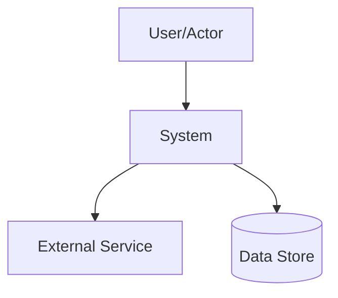

# ARCHITECTURE.md

## Purpose

Describe stable architecture so contributors and agents can locate responsibilities, constraints, and validation paths.

## Context

- System goal: <one sentence>
- Primary actors: <users/systems>
- Primary inputs: <events/requests/data>
- Primary outputs: <user-visible behavior/data/events>
- Healthy state: <what good looks like>

## Views Used

| View | Why it is included |
|---|---|
| Context | <stakeholder concern> |
| Container/module | <stakeholder concern> |
| Flow | <stakeholder concern> |

## System View

## Boundaries

- In scope: <owned capabilities>
- Out of scope: <external/non-owned concerns>

## Module Map

| Module | Owns | Key paths | API boundary |
|---|---|---|---|
| `<module-a>` | <responsibility> | `<path>` | yes/no |
| `<module-b>` | <responsibility> | `<path>` | yes/no |

## Dependency Rules

- `<module-a>` may depend on `<module-b>`.
- `<module-b>` must not depend on `<module-a>`.
- <additional rule>

## Forbidden Couplings

| Coupling | Status | Enforcement |
|---|---|---|
| `<a> -> <b>` | forbidden | `<tool/test/policy>` |

## Core Flows

### Flow: <name>

1. <entry>
2. <major processing step>
3. <result>

## Decisions

- ADR/RFC index: `<path>`
- Related decisions:
  - `<link>` — <one-line relevance>

## Verification

| Concern | Command/check | Expected signal |
|---|---|---|
| Dependency rules | `<command>` | <result> |
| Core flow | `<command>` | <result> |
