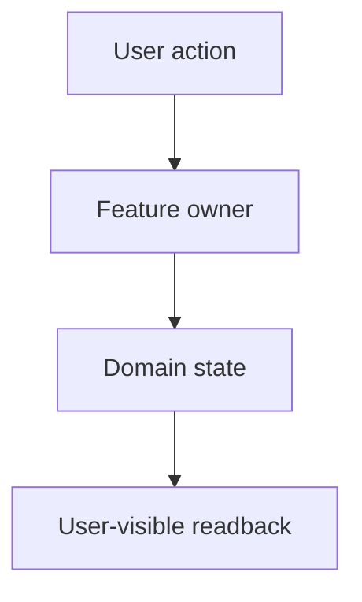

# Feature: <Feature Or Domain Name>

## Simple Version

<Explain the feature in plain English. Say what it is, what it is not, and why it exists. This should be understandable without reading code.>

## Goal

<State the durable product goal or thesis. Focus on what the feature helps the user understand, do, trust, or recover.>

## Why This Matters

<Explain the product consequence. Name the recurring confusion, risk, duplicate truth, missing source of record, or workflow gap this doc prevents.>

## Current Product State

<Describe what exists today. Include important limitations, current entry points, and current source-of-truth boundaries.>

## Future Product State

<Describe the intended stable shape only if it differs from today. Keep it grounded; do not turn this into a roadmap dump.>

## In Scope

- <Behavior, surface, domain object, or user flow included.>
- <Behavior, surface, domain object, or user flow included.>

## Out Of Scope

- <Adjacent feature, behavior, or system intentionally excluded.>
- <Thing future agents should not add by accident.>

## User-Visible Surfaces

### <Surface Or Mode>

- What the user sees: 

- What the user can do: <actions>
- What this surface owns: <ownership boundary>
- What it must not own: <non-owner boundary>

## How It Works

<Explain the real runtime flow in a walkthrough style. Name the important state transitions and ownership boundaries.>

## Ownership

- `<Owner or module>`
  - owns <responsibility>
- `<Owner or module>`
  - owns <responsibility>

## Data / State Model

<Use this section when the feature has important records, queries, snapshots, state machines, sync behavior, or domain objects. Omit it for small pure-UX features.>

- `<field or concept>`: <meaning and source of truth>
- `<field or concept>`: <meaning and source of truth>

## Product Language

Prefer:

- `<copy or tone rule>`

Avoid:

- `<copy or tone anti-pattern>`

## Acceptance Criteria

- Given <state>, when <user action>, then <observable result>.
- Given <state>, when <system event>, then <observable result>.

## Verification

- Manual: <specific flow or state to check>
- Automated: <test, script, or focused check>
- Evidence: <known proof, or `Not yet verified`>

## Risks And Failure Modes

- Risk: <what could drift, duplicate truth, or confuse the user>
  - Mitigation: <boundary, test, copy rule, or verification>

## Post-Implementation Notes

<Use after implementation only. Summarize shipped behavior, known gaps, and differences from intended future scope. Omit for fresh PRDs/specs.>
