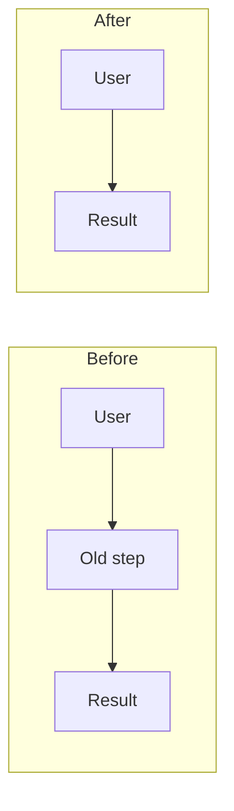
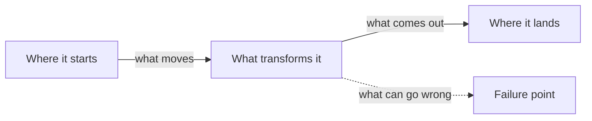
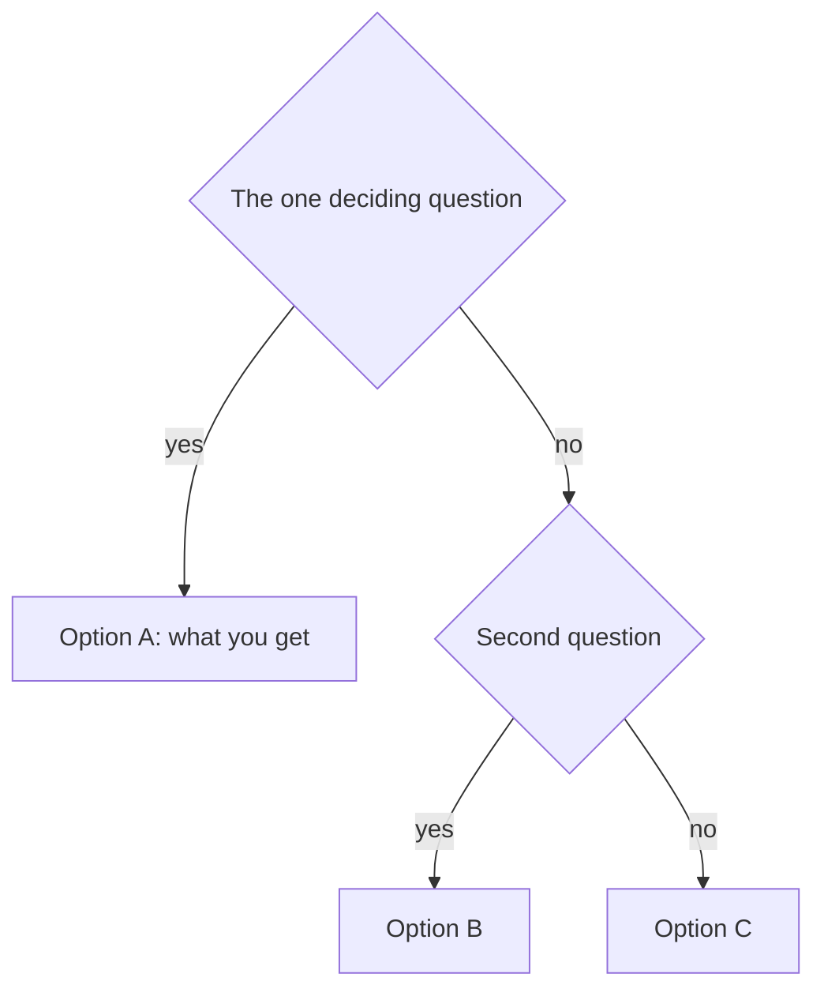
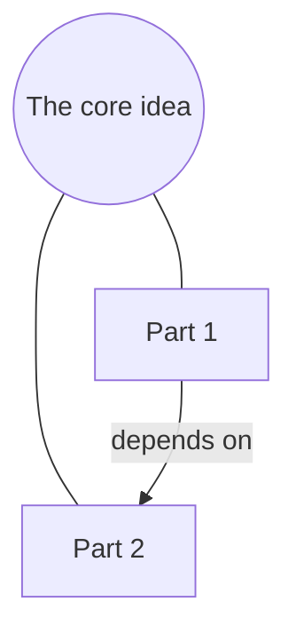

# Visual Patterns

Ready skeletons for the visual ladder. Pick the pattern whose *question*
matches, swap the labels, delete what the concept doesn't need. Every
pattern answers one question — if none fits, prose was probably right.

## Before / After — "what changed?"



Use for: refactors, process changes, product redesigns, policy changes.
The payoff is the *deleted* box — make what disappeared obvious.

## Data / Money / Information Flow — "how does it move?"



Use for: system behavior, financial flows, approval chains, integrations.
One label per arrow; name the failure point when the question is "why did
it break" or "what's the risk".

## Timeline — "when, and in what order?"

```text
Jan ─── Feb ─── Mar ─── Apr
 │       │       │       │
 kickoff draft   review  ship
                 ▲ you are here
```

Use for: plans, histories, incident sequences. Always mark "you are here"
or "the moment that matters".

## Decision Tree — "which one applies to me?"



Use for: choices, eligibility, routing, "should I X or Y". Two levels max —
a third level means the prose framing is wrong, not the tree.

## Comparison Table — "how do these differ?"

| | Option A | Option B |
|---|---|---|
| Best when | … | … |
| Cost / effort | … | … |
| The catch | … | … |

Use for: 2-4 alternatives. Rows are the *reader's* decision criteria, not
the options' feature lists. "The catch" row is mandatory — it's the row
people actually reread.

## Concept Map — "how do these ideas relate?"



Use for: unfamiliar domains, jargon clusters, "how does X relate to Y".
Five nodes maximum; a map that needs more should become two explanations.

## Funnel / Losses — "where does it leak?"

```text
100 started
 ├─ 62 completed step 1   (-38: where and why)
 ├─ 31 completed step 2   (-31: where and why)
 └─  9 finished           (the number that matters)
```

Use for: conversion, attrition, process losses. Annotate the biggest drop,
not every step.

## Layered "How X Works" — relay-mode artifact skeleton

For a rendered HTML artifact (ladder level 5), structure the page as the
same three layers the chat answer uses: the answer (one bold paragraph),
the mechanism (one diagram from this file + 3-5 numbered steps), what to do
with it (one short list). Self-contained, both themes, verified per
visual-proof before sharing.

## Charts

Quantities follow the local dataviz skill or method when one is available —
form first, color by job, validate the palette, render and look. Reach for a chart only when the
*magnitude or trend* is the point; if the point is a single number, a stat
line in prose beats a chart.
