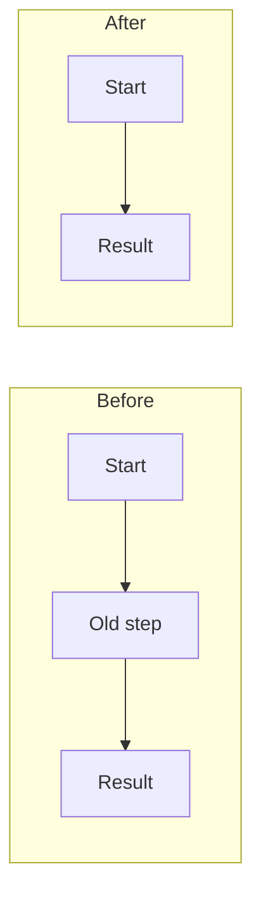
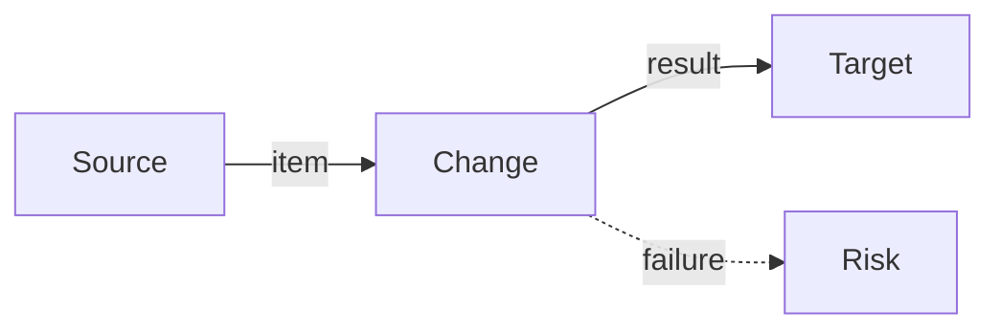
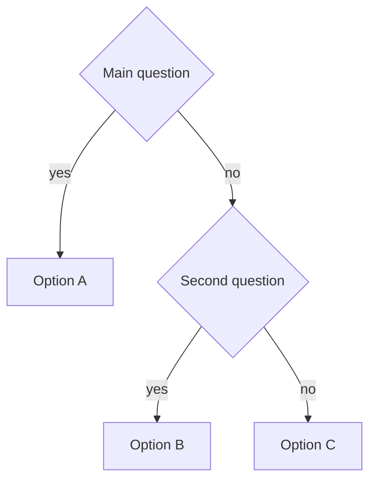
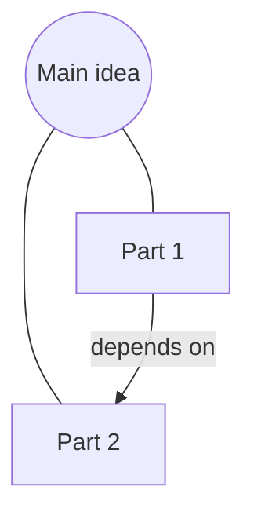

# Visual patterns

Select one pattern. If a part does not answer the user's question, delete it.

## Change

Use this pattern to show what changed:


```mermaid
flowchart LR
  subgraph Before
    A1[Start] --> B1[Old step] --> C1[Result]
  end
  subgraph After
    A2[Start] --> C2[Result]
  end
```

## Flow

Use this pattern to show how data, money, or information moves:


```mermaid
flowchart LR
  A[Source] -->|item| B[Change]
  B -->|result| C[Target]
  B -.->|failure| D[Risk]
```

If the failure changes the answer, show the failure path.

## Sequence

Use this pattern to show order or time:

```text
Start ─── Step 1 ─── Step 2 ─── Result
                      ▲ current point
```

Mark the event or time that answers the question.

## Decision

Use this pattern to show which option applies:


```mermaid
flowchart TD
  Q{Main question} -->|yes| A[Option A]
  Q -->|no| Q2{Second question}
  Q2 -->|yes| B[Option B]
  Q2 -->|no| C[Option C]
```

Use no more than two questions. If the decision needs more levels, use prose.

## Comparison

Use this pattern to compare two to four options:

| | Option A | Option B |
|---|---|---|
| Best use | ... | ... |
| Cost | ... | ... |
| Limit | ... | ... |

Use criteria that affect the user's decision.

## Relationship

Use this pattern to show how ideas connect:


```mermaid
flowchart TD
  A((Main idea)) --- B[Part 1]
  A --- C[Part 2]
  B -->|depends on| C
```

Use no more than five nodes. If the map needs more nodes, use prose.

## Quantity

If size or trend is the main point, use a chart. If one number is the main point,
use a text value.
