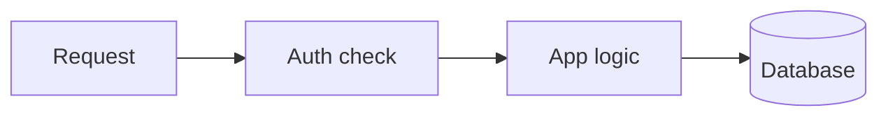
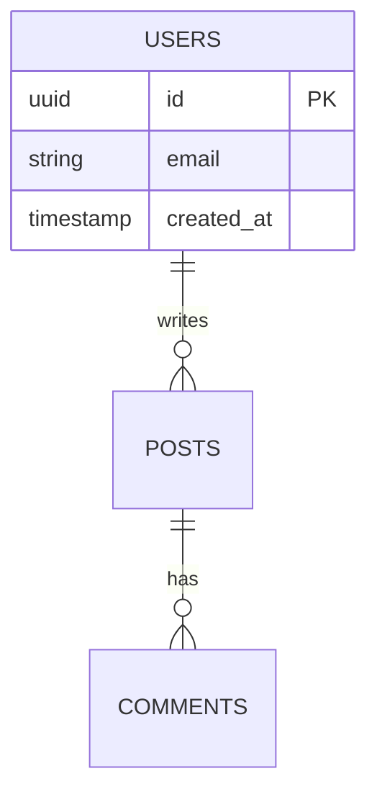

# Diagram Guidance

Use this when the user asks for a diagram, map, flow, architecture, lifecycle,
ERD, or visual explanation of how something works.

## Pick The Diagram Family

Choose by intent, not by topic:

| User intent | Best form | Notes |
|---|---|---|
| Steps, lifecycle, branching, cause/effect | Flowchart | Mermaid is usually enough. Use SVG only when spatial placement matters. |
| Components, containment, architecture, ownership | Structural map | Use boxes, groups, boundaries, and a few arrows. |
| Sequence across actors over time | Sequence diagram | Mermaid sequence diagrams handle layout better than hand SVG. |
| State changes | State diagram | Mermaid state diagrams avoid crowded arrows. |
| Database schema or entities | Mermaid ERD | Avoid hand-drawn ERDs; table layout and connectors are error-prone. |
| How a mechanism feels or behaves | Illustrative diagram | Use a spatial metaphor, cross-section, or simple schematic. |
| Many values or comparisons | Chart | Use [charts.md](charts.md). |

For "how does X work" with no further qualification, prefer an illustrative
mechanism or interactive explainer over a generic flowchart. For "architecture",
"schema", "pipeline", "steps", or "sequence", prefer the reference diagram.

## Mermaid First

Use Mermaid when its grammar naturally fits:

Keep Mermaid labels short. Use prose before or after the diagram for detail.

Use Mermaid ERD for schemas:

## SVG When Mermaid Is Not Enough

Create SVG for custom spatial diagrams, product object mockups, cutaways,
illustrative mechanisms, and visual metaphors. Save the SVG under
`.agents/outputs/`, then display it with an absolute Markdown image path.

SVG setup:

- Use `viewBox="0 0 680 H"` for most diagrams. Keep the width at 680 and set
  `H` to the bottom-most element plus padding.
- Keep content inside x=40..640 when possible.
- Avoid negative coordinates.
- Set `width="100%"` and let the viewBox scale.
- Use a transparent background unless the subject needs a fixed scene
  background.
- Include `fill="none"` on connector paths and polylines.

ViewBox safety checklist:

1. Find the lowest visual element and set height to that value plus 20-40px.
2. Find the rightmost element and keep it within the viewBox.
3. Check labels with `text-anchor="end"`; they extend left from the anchor.
4. Confirm every row of boxes has at least 20px between neighboring boxes.
5. Confirm arrows do not cross unrelated boxes or labels.

## Flowcharts

- Prefer a single direction: top-down or left-right.
- Keep a diagram to four or five nodes when possible.
- Size boxes from the longest label: roughly 8px per 14px character plus 24px
  horizontal padding.
- Two-line boxes need at least 56px height; single-line boxes need about 44px.
- Arrows should stop at component edges with a small gap before the arrowhead.
- If a direct arrow crosses another box, route around with an L-shaped path.
- Avoid arrow labels unless the meaning is not clear from the source and target.

Cycles rarely work as rings. Use a linear flow with a return arrow or an
interactive stepper where the final step returns to the first.

## Structural Maps

- Use large rounded rectangles for containers and smaller rectangles for regions.
- Keep nesting to two or three levels.
- Leave at least 20px padding inside containers.
- External inputs and outputs can sit outside the main container with arrows in
  or out.
- Put text inside regions, not mini flowcharts inside regions.
- Use related but distinct colors for nested regions so the hierarchy remains
  visible.

## Illustrative Diagrams

Illustrative diagrams build intuition. Draw the mechanism, not a box diagram
about the mechanism.

- Physical subjects get simplified cutaways, schematics, or cross-sections.
- Abstract subjects get spatial metaphors: stacks, funnels, clusters, trails,
  layers, fields, buckets, or flows.
- Color should show intensity, state, material, or direction.
- Shapes may overlap for depth, but labels need clear air.
- Simple indicators are allowed when they communicate state: particles, bubbles,
  wavy heat lines, flow arrows, traces, or stacked frames.
- Prefer interactive HTML when the real system has a control, parameter, or
  operating mode the user can manipulate.

## Multi-Diagram Narratives

For complex topics, use several small diagrams instead of one crowded diagram.
Put a short prose bridge between visuals explaining what changed or what the
next diagram adds.

Do not promise a visual that is not delivered. Adjust the prose to match the
actual output.
