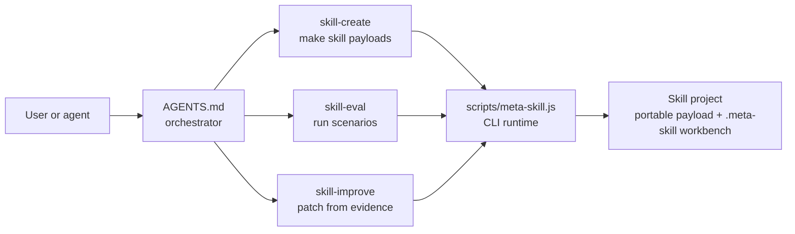
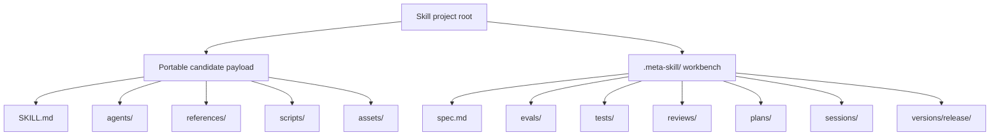
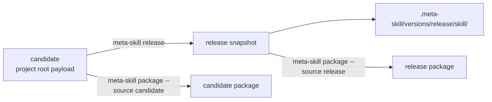
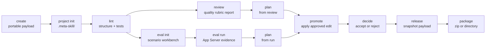
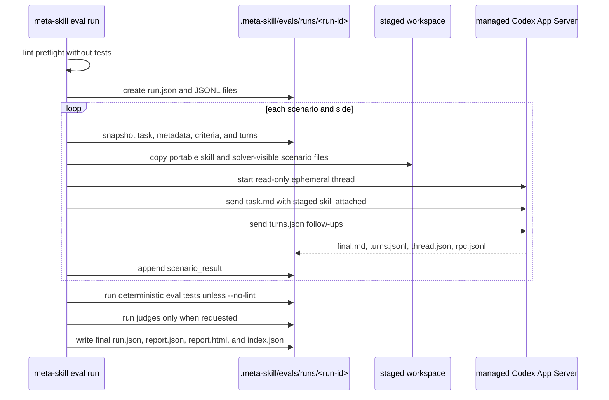
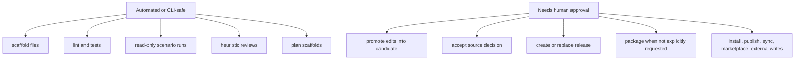

# Meta Skill Architecture

Meta Skill is a Codex-only plugin for building, evaluating, improving,
releasing, and packaging reusable skills. It is one plugin with three lane
skills and one CLI.

## Big Picture



It creates portable payloads, adds `.meta-skill/` workbenches, records eval
evidence, turns evidence into bounded edits, snapshots releases, and packages
candidate or release payloads. It is not a marketplace publisher, installer, or
sync system. Human approval remains required for promotion, release replacement,
packaging, install, publish, marketplace sync, and external writes.

## Repository Map

```text
plugins/meta-skill/
  AGENTS.md                     plugin orchestrator prompt
  .codex-plugin/plugin.json     plugin manifest
  package.json                  Node package root and meta-skill bin
  package-lock.json             locked TypeScript toolchain
  tsconfig.json                 production TypeScript build
  tsconfig.test.json            test TypeScript build
  scripts/meta-skill.js         Node bin entrypoint to app/main.js
  src/                          TypeScript source
  app/                          committed JavaScript runtime
  assets/                       manifest icon and logo
  skills/
    skill-create/               creation lane and references
    skill-eval/                 eval lane and references
    skill-improve/              improvement lane and references
```

`scripts/meta-skill.js` runs `app/main.js`, so TypeScript changes must be
rebuilt into `app/`. The committed runtime is not optional.

This plugin is separate from generated Agent plugin packages under
`plugins/codex/agent/` and `plugins/claude/agent/`. Do not hand-edit those
generated packages.

## Skill Project Model



The project root is the current candidate. Only `SKILL.md`, `agents/`,
`references/`, `scripts/`, and `assets/` can be packaged. `.meta-skill/` stores
specs, scenarios, run evidence, tests, reviews, plans, promotion sessions, and
release snapshots. It must not be packaged.

Candidate and release are different:



## Lifecycle



Lane boundaries: `skill-create` scaffolds, `skill-eval` measures without
editing source, and `skill-improve` edits only from evidence with gates.

## CLI Ownership

Top-level command dispatch lives in `src/commands.ts`.

| Command | Owner |
|---|---|
| `create` | `src/skills.ts` |
| `project init` | `src/skills.ts`, `src/project.ts` |
| `lint` | `src/lint.ts` |
| `review` | `src/review.ts` |
| `eval init` | `src/eval/scenarios.ts` |
| `eval run` | `src/eval/run.ts` |
| `eval judge` | `src/eval/judge.ts` |
| `eval feedback import` | `src/eval/runs.ts` |
| `eval open`, `eval list`, `eval view` | `src/eval/runs.ts` |
| `plan`, `promote`, `decide` | `src/improve.ts` |
| `release` | `src/versions.ts` |
| `package` | `src/package.ts` |

Shared helpers are `src/project.ts` for paths, JSON/JSONL, payload copying,
IDs, git context, and token-unavailable records; `src/models.ts` for data
contracts; and `src/report.ts` for reports.

## Eval Runner



Default runner constraints: managed stdio App Server, read-only sandbox,
`approvalPolicy: "never"`, no network access, one thread per scenario side,
first turn with staged skill attached, follow-ups from `turns.json`, and token
metrics recorded as available or explicitly unavailable.

`--app-server-endpoint` is not supported yet; the CLI rejects it.

Live App Server behavior is opt-in. The normal test run skips
`src/app-server/live-smoke.test.ts` unless `META_SKILL_LIVE_APP_SERVER=1`
is set and Codex App Server auth is available.

## Evidence Layout

```text
.meta-skill/evals/
  evals.json
  scenarios/
    R1-basic/
      task.md
      scenario.json
      criteria.json
      turns.json          optional
      capability.txt      optional
      resources/          optional
    judges/
  runs/
    001-initial-candidate/
      run.json
      events.jsonl
      results.jsonl
      tests.jsonl
      grades.jsonl
      feedback.jsonl
      report.json
      report.html
      snapshots/
        R1-basic/
          task.md
          scenario.json
          criteria.json
      scenarios/
        R1-basic/
          candidate/
            stage/
            thread.json
            turns.jsonl
            final.md
            rpc.jsonl
            artifacts/
          release/
            ...
```

Scenario IDs are strict: `R` regression, `F` failure mode, `T` trigger, and
`G` gate. `run.json` is the run header; JSONL files store events, scenario
results, deterministic tests, judge grades, and feedback. `report.json` is the
normalized summary consumed by `report.html`, `eval open --json`, and
`runs/index.json`.

Solver staging does not include `criteria.json`. Criteria are evaluator
evidence and are captured in `snapshots/` so judges grade old finals against
the scenario definitions used by that run. Legacy runs without snapshots must
be marked as using current scenario definitions.

## Human Gates



Keep the verbs separate: `promote` edits candidate files, `decide` records
accept or reject, `release` snapshots candidate, and `package` emits an artifact.

## Build And Tests

Run from `plugins/meta-skill/`:

```bash
npm run typecheck
npm test
npm run build
```

`npm test` builds tests into `app/`, runs `node --test "app/**/*.test.js"`,
then rebuilds production runtime into `app/`. Tests cover layout and
packaging, lint and manifests, eval orchestration, App Server protocol, staging,
token usage, the opt-in live smoke contract, and runtime package shape.

Root Agent sync is not required for this architecture doc. If a change touches
root `AGENTS.md`, `.codex/agents/`, `assets/agent/`, or source `skills/`, run
`scripts/sync-plugins.sh` before committing.

## Current Limits

- `needs_review` is unresolved evidence, not proof of pass. A completed App
  Server scenario usually returns `needs_review` unless deterministic checks,
  judges, or harness errors classify a failure.
- `review` writes a deterministic quality-rubric fallback with Discovery,
  Implementation, Validation, and Suggestions. It represents the read-only
  reviewer concept but does not claim a live semantic subagent ran.
- `plan` is a scaffold. It creates an empty edit list that someone must fill
  from evidence before `promote`.
- `eval generate` is scaffolded but unsupported.
- Baseline/no-skill comparison and true trigger routing are unsupported because
  the current App Server runner force-attaches the staged skill on the first
  turn.
- Attached App Server endpoints are not implemented.
- The plugin is Codex-only and depends on Codex skill attachment plus App Server.
- `src/` and committed `app/` can drift if maintainers forget to build.
- Replacing an existing release snapshot requires interactive confirmation.

## Extension Checklist

Add commands in `src/commands.ts`, keep logic in the owning module, update
`src/models.ts` for new data shapes, test the changed area, run `npm test`,
and commit regenerated `app/` for code changes.

For eval changes, preserve `.meta-skill/evals/runs/<run-id>/`, scenario-side
evidence under `scenarios/<scenario>/<side>/`, unavailable-token records,
read-only/no-approval/no-network defaults, and optional judges.

For package changes, package only the portable payload, never `.meta-skill/`,
keep candidate and release separate, and keep promote, decide, release, and
package as separate gated operations.

For lane changes, edit `plugins/meta-skill/skills/<lane>/`, update references
when syntax or paths change, and keep `AGENTS.md` aligned with routing and gates.
