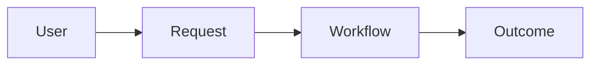
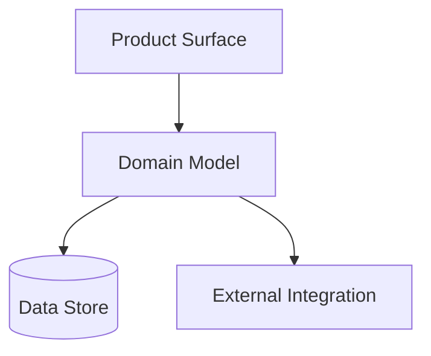

# Context Doc Format

Use this reference when `clarify` needs to create a durable context doc and the user did not request a different artifact.

Default path when the repo does not already define a better canonical location:

- `docs/artifacts/contexts/<topic>-context.md`

## Purpose

Capture the current shared understanding of a topic in plain language so future planning, design, or implementation can start from the same baseline.

This is not an execution plan.

## Core Rules

- Start from the smallest useful shape.
- Adapt the format to the topic instead of copying a rigid template.
- Prefer simple language, clear boundaries, and visual explanation over code-heavy detail.
- Keep the document inside `docs/`; do not mirror the content into source files.
- If the repo already has an established spec or architecture doc family, reuse that instead of forcing this format.

## Required Sections

Every context doc should include:

```md
# <Topic>

## Purpose
<1-2 short paragraphs on what this topic is and why it matters>

## Canonical Terms
- **<term>**: <tight definition>
- Avoid: <aliases or overloaded terms to avoid>

## Relationships
- <concept A> relates to <concept B> because ...

## Key Ambiguities Resolved
- <ambiguous phrase> -> <resolved meaning>

## Examples Or Scenarios
- <short concrete scenario that shows how the concepts interact>

## Open Questions
- <question>
```

## Optional Sections

Add only the sections that help this specific topic:

- `## Boundaries And Non-Goals`
- `## Actors Or Stakeholders`
- `## Inputs And Outputs`
- `## States And Transitions`
- `## Core Flow`
- `## Ownership`
- `## Interfaces`
- `## Constraints`
- `## Risks And Failure Modes`
- `## Decision Notes`
- `## References`

## Topic-Specific Ideas

Use these as prompts, not mandatory structure.

### If the discussion is architecture-heavy

Add:

- `## System Shape`
- `## Module Or Service Boundaries`
- `## Data Ownership`
- `## Integration Points`

Include at least one simple Mermaid diagram when it clarifies shape or flow.

Good diagram types:

- system boundary diagrams
- context maps
- flowcharts
- sequence diagrams
- state diagrams

### If the discussion is product or feature intent

Add:

- `## User Intent`
- `## In Scope`
- `## Out Of Scope`
- `## Success Signal`

If the conversation becomes a broader desired architecture or implementation intent document, consider switching to a project spec instead.

### If the discussion is terminology-heavy

Bias toward:

- stronger `Canonical Terms`
- more `Key Ambiguities Resolved`
- more concrete example scenarios

## Diagram Guidance

Prefer diagrams that explain shape, ownership, and flow at a glance.

Good:

- simple boxes and arrows
- one main flow per diagram
- labels written in plain English

Avoid:

- code-like diagrams
- deeply nested graphs
- diagrams that duplicate the exact same prose without adding clarity

## Example Snippets

### Simple relationship diagram



### Simple ownership diagram


