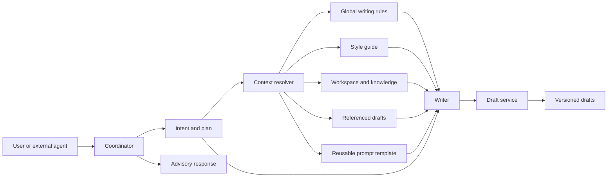
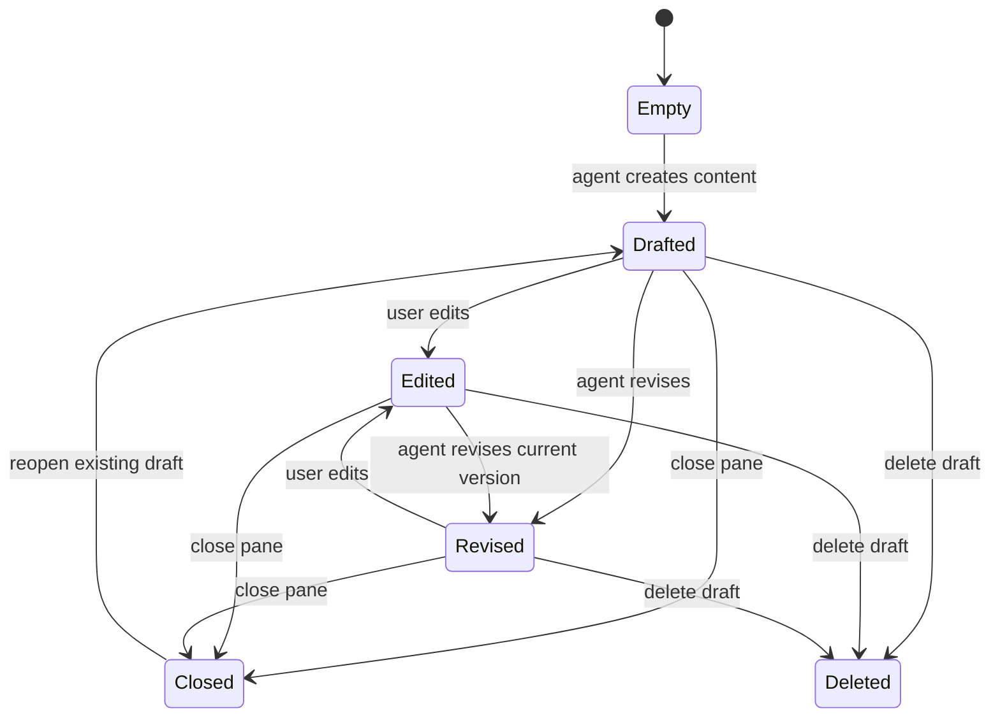

# Agent-first writing system specification

## Objective

Build an agent-native writing engine that can learn a user’s voice from samples, retrieve workspace knowledge, create or revise durable drafts, and expose the same core capability to other agents over MCP.

The first version does not need a bespoke product UI. A thin test harness, API, and MCP server are sufficient if they prove the full path from source material to grounded, versioned writing.

## Status language

This document uses three evidence labels:

- **Observed**: directly exercised or visible in Spiral on August 6, 2026.
- **Inferred**: strongly suggested by observed behavior but not verified at the transport or source-code level.
- **Proposed**: the smallest implementation contract recommended for this rebuild. It may differ internally from Spiral while reproducing the important behavior.

The working evidence is retained in `.agents/outputs/spiral_observation_log.md`.

## Product contract

The system is not a generic chat assistant with a tone prompt. It is a writing runtime with four durable inputs and one durable output:

1. Global writing rules that always apply.
2. A learned style guide derived from the user’s samples.
3. Workspace context and retrieved knowledge.
4. A message-specific brief, reusable prompt, and optional draft references.
5. One or more editable, versioned drafts.

The engine must support both drafting and advisory turns. A user may ask the agent to inspect sources, identify missing information, or explain a choice without creating or changing a draft.

## Goals

- Produce writing that applies a learned, evidence-backed style rather than a generic “human” tone.
- Keep factual context and voice context separate so each can be updated independently.
- Retrieve only the knowledge and drafts needed for the current turn.
- Create multiple meaningfully distinct drafts from one request.
- Revise an existing draft in place while preserving its version history.
- Let another agent check readiness, add samples, generate writing, personalize text, and humanize text through MCP.
- Expose enough progress and tool evidence to debug context selection, grounding, and draft identity failures.
- Preserve uncertainty: absent source facts remain absent unless the user supplies them.

## Non-goals for the first build

- Reproducing Spiral’s visual design or full dashboard.
- Team billing, invitations, or shared-workspace administration.
- X/Twitter ingestion, audio recording, or a browser file-drop experience.
- A general autonomous research agent.
- Channel-specific growth advice beyond a small prompt-template library.
- Exact compatibility with Spiral’s private REST or CLI interfaces.
- Reproducing hidden prompts, model routing, or server infrastructure that was not observed.

## Primary scenarios

### Learn a voice

The user creates a style, assigns a target channel, and adds one or more writing samples. The system analyzes those samples and generates an editable style guide containing concrete instructions and supporting examples.

### Generate a grounded draft

The user asks for writing in a workspace with a selected style. The coordinator identifies the needed knowledge, retrieves it, fetches the style guide, and delegates to the writer. The writer creates a named draft and reports its word count.

### Generate variants

The user requests two or three drafts. Before writing, the writer states a distinct angle for each. Each variant becomes an independent draft record. One user turn consumes one quota unit regardless of variant count.

### Revise an existing draft

The user refers to an open or named draft and asks for a change. The coordinator resolves the draft identity, reads the current version, fetches the selected style, and updates the same draft with a new version. It does not silently create an unrelated draft.

### Inspect knowledge without drafting

The user asks what a source confirms or omits and explicitly says not to draft. The coordinator reads the relevant knowledge, responds in chat, and does not invoke the writer or create a draft.

### Connect another agent

An MCP client connects over browser OAuth. It checks voice readiness and quota, then invokes generation or rewriting tools. Setup and read operations may work on Free; writing operations may be gated by plan.

## Conceptual model



### Workspace

**Observed:** A workspace groups chats, styles, prompts, and knowledge. Its description is included in every chat.

**Proposed minimum fields:**

```ts
type Workspace = {
  id: string
  name: string
  description: string // max 4,000 characters
  createdAt: string
  updatedAt: string
}
```

### Global writing rules

**Observed:** These take priority over all other instructions and apply to every draft. The product combines free-form rules with built-in “Avoid AI phrasings” and “Avoid em dashes” switches.

```ts
type WritingRules = {
  freeform: string
  avoidAiPhrasings: boolean
  avoidEmDashes: boolean
  updatedAt: string
}
```

Rules are account-scoped in the first build. Workspace-specific overrides are out of scope.

### Style

```ts
type Style = {
  id: string
  workspaceId: string
  name: string
  channel:
    | "general"
    | "academic-paper"
    | "blog"
    | "book"
    | "email"
    | "instagram-tiktok"
    | "linkedin"
    | "newsletter"
    | "x-twitter"
    | "other"
  customChannel?: string
  summary?: string
  guide?: string
  status: "empty" | "ready-to-analyze" | "analyzing" | "ready" | "failed"
  createdAt: string
  updatedAt: string
}
```

### Style sample

```ts
type StyleSample = {
  id: string
  styleId: string
  sourceType: "paste" | "url" | "file" | "connection"
  title: string
  text: string
  sourceUrl?: string
  included: boolean
  wordCount: number
  createdAt: string
}
```

### Prompt template

```ts
type PromptTemplate = {
  id: string
  workspaceId: string
  command: string // unique within workspace, without leading slash
  body: string // max 20,000 characters
  styleId?: string // absent means Automatic
  createdAt: string
  updatedAt: string
}
```

### Knowledge item

```ts
type KnowledgeItem = {
  id: string
  workspaceId: string
  title: string
  sourceType: "paste" | "file" | "url"
  text: string
  summary?: string
  status: "processing" | "ready" | "failed"
  createdAt: string
  updatedAt: string
}
```

The summary is retrieval-oriented. It should say what the item contains and when it is useful, not merely repeat its opening sentence.

### Chat and message

```ts
type Chat = {
  id: string
  workspaceId: string
  title: string
  createdAt: string
  updatedAt: string
}

type Message = {
  id: string
  chatId: string
  role: "user" | "assistant"
  text: string
  promptTemplateIds: string[]
  styleId?: string
  referencedDraftIds: string[]
  attachmentIds: string[]
  createdAt: string
}
```

### Draft and version

```ts
type Draft = {
  id: string
  chatId: string
  workspaceId: string
  title: string
  currentVersionId: string
  createdAt: string
  updatedAt: string
}

type DraftVersion = {
  id: string
  draftId: string
  parentVersionId?: string
  author: "user" | "agent"
  content: string
  wordCount: number
  characterCount: number
  sourceMessageId?: string
  createdAt: string
}
```

Versions are immutable. Updating a draft creates a new version and moves `currentVersionId`. Undo and redo move the pointer through known versions or create a new user version; the implementation must choose one behavior and test it explicitly.

## Instruction and context precedence

**Observed:** Global writing rules are the highest-priority writing instructions.

**Proposed precedence for the rebuild:**

1. Safety and system constraints.
2. Global writing rules.
3. Explicit instructions in the current user message.
4. The selected reusable prompt template.
5. The selected style guide and channel conventions.
6. Workspace description.
7. Retrieved knowledge and referenced drafts as factual context.
8. General model defaults.

Factual context is not an instruction layer. A retrieved document may constrain claims but must not override user intent or global rules.

If instruction sources conflict, the coordinator records the conflict in its trace and resolves it using the order above. If two sources at the same level conflict materially, it asks the user rather than silently choosing.

## Agent architecture

### Coordinator

The coordinator owns intent, context selection, and state transitions. It does not draft long-form content itself.

Responsibilities:

- Classify the turn as advisory, generate, revise, personalize, humanize, or setup.
- Resolve workspace, selected style, prompt tokens, attachments, and referenced drafts.
- Decide which knowledge items are relevant.
- Resolve target draft identity before a revision handoff.
- Plan distinct angles when multiple drafts are requested.
- Enforce quota once per accepted user turn.
- Delegate writing work and summarize the result.

Required coordinator tools:

```text
search_knowledge(query, workspace_id, limit)
read_knowledge_items(ids)
list_drafts(chat_id)
read_drafts(ids)
get_style_guide(style_id)
create_draft(chat_id, title, content, source_message_id)
revise_draft(draft_id, expected_version_id, content, source_message_id)
check_quota(account_id)
```

### Writer

The writer receives an explicit brief and a bounded context packet. It does not search the entire workspace independently unless the coordinator delegates that task.

Input packet:

```ts
type WriterRequest = {
  operation: "generate" | "revise" | "personalize" | "humanize"
  brief: string
  globalRules: WritingRules
  styleGuide?: string
  channel?: Style["channel"]
  workspaceDescription?: string
  knowledge: Array<{
    id: string
    title: string
    text: string
  }>
  sourceDraft?: {
    id: string
    versionId: string
    title: string
    content: string
  }
  variantPlan?: Array<{
    index: number
    angle: string
  }>
}
```

Output packet:

```ts
type WriterResult = {
  drafts: Array<{
    title: string
    content: string
    angle?: string
  }>
  grounding: Array<{
    claim: string
    knowledgeItemIds: string[]
    status: "supported" | "inferred" | "unsupported"
  }>
  warnings: string[]
}
```

The grounding array is a proposed improvement over observed Spiral behavior. It exists because retrieval alone did not prevent unsupported specifics from appearing in a generated variant.

### Style analyzer

The style analyzer converts included samples into an editable guide.

It should analyze at least:

- Sentence-length distribution and variation.
- Paragraph length and progression.
- Typical openers and claim placement.
- Point of view and pronoun use.
- Punctuation habits.
- Concrete versus abstract vocabulary.
- Verb and modifier patterns.
- Metaphor domains.
- Tone, emotional range, humor, and hedging.
- Channel-specific structure.

The guide must contain:

- A concise summary.
- Concrete instructions, not only observations.
- Short supporting excerpts from samples.
- Prohibitions only when the samples support them.
- A warning when the sample set is too small or internally inconsistent.

The analyzer never presents conclusions as mathematically stable when only one short sample is available.

## Turn execution

### Generate

1. Validate quota and request shape.
2. Resolve the selected style; fetch its guide if ready.
3. Expand reusable prompt tokens into instructions.
4. Retrieve relevant knowledge and read the selected items.
5. If `draftCount > 1`, produce a distinct angle plan before drafting.
6. Call the writer once with all planned variants, or concurrently once per variant using the same frozen context packet.
7. Run claim grounding and global-rule checks.
8. Create each draft as a separate record.
9. Return draft identifiers, titles, word counts, angles, warnings, and elapsed time.
10. Consume one quota unit after at least one draft is durably saved.

### Revise

1. Resolve the target draft by explicit ID, attached reference, active-draft state, or exact title—in that order.
2. If resolution returns zero or multiple drafts, stop and ask for a choice.
3. Read the current version and record its version ID.
4. Fetch the selected style and only the knowledge required by the revision.
5. Ask the writer to revise, preserving factual constraints unless the user changes them.
6. Validate requested boundaries such as length.
7. Write with optimistic concurrency using `expected_version_id`.
8. If the draft changed concurrently, do not overwrite it. Return a conflict with both version IDs.
9. Save a new agent version and leave older versions intact.

### Advisory

1. Detect explicit “do not draft” or a question that does not require document mutation.
2. Retrieve the smallest relevant source set.
3. Answer in chat with confirmed facts, inferences, and missing information separated where material.
4. Do not invoke draft mutation tools.
5. Consume quota according to the chosen business rule; observed Spiral consumes a free message for this turn.

## Grounding contract

Every externally checkable factual claim in generated writing must be one of:

- Directly supported by retrieved knowledge or user-provided text.
- Clearly labeled as an inference.
- Omitted.

The writer must not add illustrative specifics that read as facts when the source does not contain them. Examples such as “the relevant claim is on page twelve” are unsupported unless explicitly marked hypothetical.

Before saving a draft:

- Extract candidate factual claims.
- Match each claim to one or more retrieved passages.
- Reject or rewrite unsupported claims.
- Preserve explicit negative constraints such as unsupported formats.
- Return missing launch-critical facts as warnings rather than filling them in.

## Draft lifecycle



Closing hides a draft editor; it does not delete the draft. Reopening restores the current version. Deletion is a separate confirmed action.

## MCP compatibility surface

The rebuild should expose Spiral’s seven public tool names so agents can use the same mental model. Exact parameter compatibility is proposed, not observed.

### `spiral_voice_status`

Returns whether the account has a usable style profile and what is missing.

```json
{
  "ready": true,
  "default_style_id": "style_123",
  "sample_count": 4,
  "warnings": []
}
```

### `spiral_onboard`

Creates or resumes the minimum onboarding flow and returns the next required action.

### `spiral_add_voice_samples`

Adds pasted text, URLs, or uploaded-file text to a style, then optionally starts analysis.

### `spiral_check_quota`

Returns plan, remaining units, reset time if applicable, and which tool families are allowed.

### `spiral_generate_writing`

```ts
type GenerateWritingInput = {
  brief: string
  workspaceId: string
  styleId?: string
  knowledgeItemIds?: string[]
  draftCount?: 1 | 2 | 3
  channel?: string
}
```

Returns durable draft IDs as well as content. It does not return anonymous text only.

### `spiral_personalize_text`

Rewrites supplied text using a selected style while preserving meaning and factual claims.

### `spiral_humanize_text`

Removes generic AI phrasings and disallowed punctuation without requiring a learned style. If a style is supplied, the result must also conform to it.

## Authentication and authorization

**Observed public contract:** MCP uses Streamable HTTP at `https://api.writewithspiral.com/mcp/` and browser OAuth by default. OAuth may create an account automatically. Headless clients may use a personal access token.

**Proposed rebuild:**

- Use OAuth 2.1 with PKCE for interactive MCP clients.
- Scope tokens to an account and explicit workspace set.
- Separate read/setup scopes from draft-write and workspace-admin scopes.
- Show the workspace and granted operations on the consent screen.
- Store only hashed personal access tokens and show them once.
- Log authorization grants and revocations without logging source documents or draft bodies.

Suggested scopes:

```text
voice:read
voice:write
knowledge:read
drafts:read
drafts:write
workspaces:read
quota:read
```

## Quota semantics

**Observed:** Free chat quota decremented once per completed user turn. A three-variant generation consumed one message. Setup operations such as creating a style, generating a style guide, adding knowledge, and testing rules did not visibly decrement the message count.

**Proposed:**

- Count accepted writer/advisory turns, not variants.
- Do not charge failed turns that produce no durable result.
- Do not charge setup/read tools.
- Reserve quota before generation and finalize after persistence.
- Release the reservation on cancellation or unrecoverable failure.

The pricing model is a business decision and not part of the engine contract.

## Progress and observability

Every turn receives a trace ID. The runtime emits typed progress events:

```ts
type ProgressEvent =
  | { type: "plan"; summary: string }
  | { type: "tool_start"; tool: string }
  | { type: "tool_complete"; tool: string; summary: string }
  | { type: "handoff"; from: "coordinator"; to: "writer" }
  | { type: "draft_start"; index: number; angle?: string }
  | { type: "draft_complete"; draftId: string; words: number; elapsedMs: number }
  | { type: "warning"; code: string; message: string }
  | { type: "complete" }
```

Do not expose private chain-of-thought. User-visible progress should report intent, selected sources, tool outcomes, and state changes without revealing hidden reasoning tokens.

Structured logs must include:

- Trace ID, account ID, workspace ID, chat ID, and message ID.
- Operation type and target draft ID.
- Retrieved knowledge IDs and style ID, but not their raw text.
- Model/provider name and latency when permitted.
- Tool result status and error code.
- Created draft and version IDs.
- Quota reservation and finalization.

## Failure behavior

### Wrong or missing draft

Observed Spiral attempted to revise an empty draft before listing drafts and recovering the correct one. The rebuild must resolve identity before handoff.

- `draft_id` not found: return `DRAFT_NOT_FOUND`; do not create a replacement.
- Ambiguous title: return candidates and ask for selection.
- Empty draft: treat it as valid only when the user explicitly targeted it.
- Version-history request for a missing draft: return a structured 404 and remove stale client references.

### Missing knowledge

- Report missing information explicitly.
- Do not invent pricing, URLs, dates, policies, capabilities, or calls to action.
- Allow drafting with gaps only if the user accepts placeholders or omission.

### Style unavailable

- Empty style: ask for samples or proceed without style only with explicit acknowledgement.
- Analysis in progress: return retryable status and estimated readiness.
- Failed analysis: preserve samples and allow retry.

### Partial multi-draft failure

- Persist successful variants.
- Return per-variant errors.
- Charge once only if at least one requested draft succeeds.
- Retrying should generate only missing variants unless the user asks to regenerate all.

### Concurrent edit

- Reject stale agent writes with `VERSION_CONFLICT`.
- Return the expected and current version IDs.
- Never silently overwrite a user edit.

## Minimal implementation plan

### Slice 1 — Local agent loop

Build a CLI or test harness backed by fixture data:

- One workspace description.
- Free-form global rules plus the two built-in switches.
- One editable style guide supplied directly, without analysis.
- Pasted knowledge items with summaries.
- Coordinator classification: advisory, generate, revise.
- One writer model.
- Durable chats, drafts, and immutable versions in a local database.
- One- to three-draft generation.
- Claim-support warnings using retrieved source IDs.

This slice is complete when it can generate three grounded variants, revise one in place, and answer a missing-information question without mutating drafts.

### Slice 2 — Voice learning

- Style/sample CRUD.
- Asynchronous style-guide analysis.
- Editable guide and analysis status.
- Style-bound reusable prompts.
- Rule test harness.

This slice is complete when a held-out writing sample is judged closer to the selected style than the same draft produced without the guide, using a blind evaluation.

### Slice 3 — MCP server

- Streamable HTTP transport.
- OAuth with PKCE.
- The seven public tool names.
- Progress events and structured errors.
- Quota checking and reservation.

This slice is complete when a fresh MCP client can authenticate, check readiness, generate a durable draft, revise it, and retrieve the new version ID.

### Slice 4 — Production hardening

- File ingestion and text extraction.
- Retrieval evaluation and claim-level grounding.
- Concurrent-edit protection.
- Audit logs, retention controls, export, and deletion.
- Load, latency, privacy, and abuse testing.

## Acceptance criteria

### Context and routing

- Given an advisory request containing “do not draft,” no writer or draft-mutation tool is called.
- Given a generation request with a selected style and relevant knowledge, the trace shows both sources were resolved before draft creation.
- Given irrelevant knowledge in the same workspace, it is not included in the writer packet.

### Voice

- A style guide cites examples from included samples and omits excluded samples.
- Editing the guide changes subsequent output without re-ingesting samples.
- Global writing rules override a conflicting prompt template or style instruction.

### Grounding

- A requested fact absent from knowledge is reported missing and does not appear as an assertion in a saved draft.
- Negative constraints such as unsupported formats survive generation and revision.
- Unsupported claims fail validation or are explicitly labeled hypothetical.

### Drafts and versions

- Three requested variants create three draft IDs and consume one quota unit.
- Revising a target draft preserves its ID and creates a new version ID.
- A stale revision cannot overwrite a newer user edit.
- Closing and reopening a draft preserves the current content and history.
- Chat export includes messages and links or identifiers for its drafts.

### MCP

- A client can connect through OAuth without pasting an API key.
- Read/setup tools work according to plan policy.
- Gated writing tools return a structured upgrade-required error, not an authentication failure.
- Tool results include durable identifiers and warnings, not only prose.

## Security, privacy, and retention requirements

The system stores user writing samples, inferred style traits, source documents, and drafts. These are sensitive creative and business data.

- Encrypt all stored content and backups.
- Separate accounts and workspaces at every query boundary.
- Never include raw content in analytics, exception tracking, or ordinary logs.
- Make knowledge, sample, draft, chat, workspace, and account deletion explicit and auditable.
- Define retention for deleted content and backups before production use.
- Do not train shared models on user content without explicit opt-in.
- Treat URLs and uploaded documents as untrusted input.
- Sanitize extracted text before passing it to tools or models.
- Prevent retrieved documents from overriding system or user instructions.

## Risks

- A persuasive style layer can make unsupported claims sound more credible. Grounding must be validated after writing.
- Small or inconsistent sample sets can produce overconfident style rules.
- “Active draft” UI state is too fragile to serve as the only revision identifier.
- Multiple writer agents can create ordering and concurrency problems without frozen context and expected-version writes.
- Exposed progress can leak hidden prompts or private source text if event summaries are not constrained.
- Account-creating OAuth can make entitlement and identity debugging confusing when email aliases are used.

## Open verification gaps

- Exact REST and CLI contracts.
- Exact MCP tool schemas and error codes.
- Model providers, model routing, and whether generation uses one model or several.
- Server-side prompt composition and the actual precedence of style, prompt, workspace, and message instructions below global rules.
- Retrieval indexing, chunking, ranking, and citation representation.
- File types, size limits, and extraction behavior.
- Whether writing-rule testing shares the production rewrite pipeline.
- Quota reset periods and paid-plan usage accounting.
- Export formats and payload structure for individual drafts.
- Personal access token lifecycle and scope model.
- Network protocol for progress streaming.

These gaps require an authenticated network trace, official API schema, or direct product documentation. They should remain unresolved rather than being filled from interface behavior.
